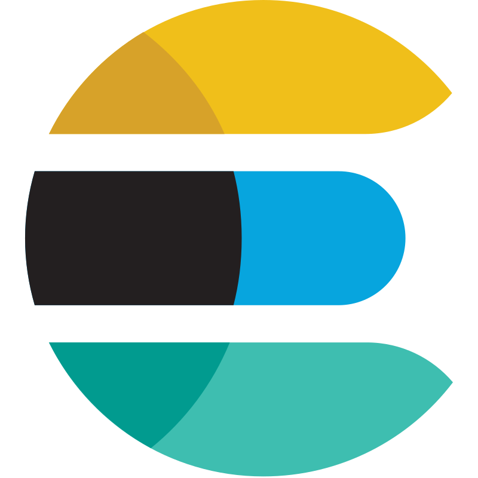
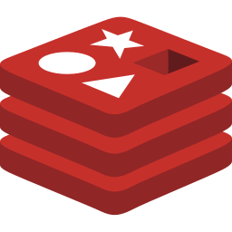
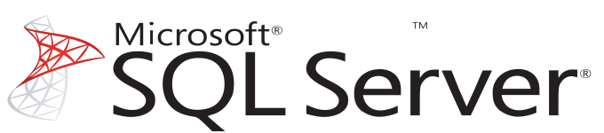
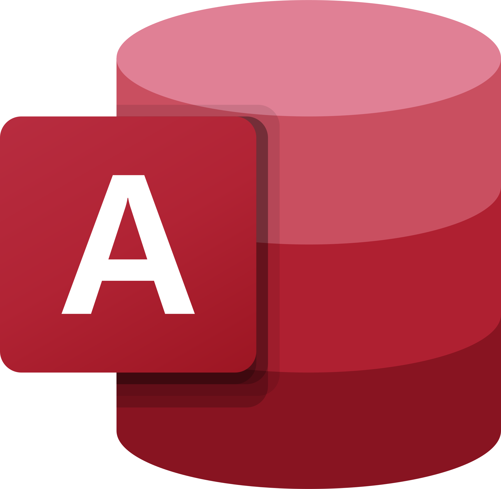

<p align="center">
    
</p>
<p align="center">Addax is a versatile open-source ETL tool</p>
<p align="center">The <a href="https://wgzhao.github.io/Addax">documentation</a> describes in detail how to install and use the plugins. It provides detailed instructions and sample configuration documentation for each plugin. </p>
<p align="center">
   <a href="https://github.com/wgzhao/Addax/releases">
      
    </a>
   <a href="https://github.com/wgzhao/Addax/workflows/Maven%20Package/badge.svg">
       
   </a>
</p>

English | [简体中文](README_zh.md)

The project's initial code was originally developed by Ali's [DataX](https://github.com/alibaba/datax) team and has been significantly improved over time based on user feedback. 
It also provides more read and write plugins, which can be beneficial for data processing tasks. If you need further clarification, you should check out this [comparison](difference.md)

## Supported Data Sources

Addax supports more than 20 SQL and NoSQL [data sources](support_data_sources.md). It can also be extended to support more.

<table>
<tr>
<td></td>
<td></td>
<td></td>
<td></td>
</tr>
<tr>
<td></td>
<td></td>
<td></td>
<td></td>
</tr>
<tr>
<td></td>
<td></td>
<td></td>
<td></td>
</tr>
<tr>
<td></td>
<td></td>
<td></td>
<td></td>
</tr>
<tr>
<td></td>
<td></td>
<td></td>
<td></td>
</tr>
<tr>
<td></td>
<td></td>
<td></td>
<td></td>
</tr>
<tr>
<td></td>
<td></td>
<td></td>
<td></td>
</tr>
<tr>
<td></td>
<td></td>
<td></td>
<td></td>
</tr>
</table>

## Getting Started

### Use docker image

```shell
docker pull quay.io/wgzhao/addax:latest
docker run -ti --rm --name addax \
  quay.io/wgzhao/addax:latest \
  /opt/addax/bin/addax.sh /opt/addax/job/job.json
```
If you want to use common reader and writer plugins, you can pull the image whose name ends with `-lite`, it's very small.

```shell
docker pull quay.io/wgzhao/addax:latest-lite
docker run -ti --rm --name addax \
  quay.io/wgzhao/addax:latest-lite \
  /opt/addax/bin/addax.sh /opt/addax/job/job.json
```

[here][lite-vs-default.md] is the difference between the default image and the lite image.

### Use install script

```shell
/bin/bash -c "$(curl -fsSL https://raw.githubusercontent.com/wgzhao/Addax/master/install.sh)"
```

This script installs Addax to its preferred prefix (/usr/local for macOS Intel, /opt/addax for Apple Silicon and /opt/addax/ for Linux)

### Compile and Package

```shell
git clone https://github.com/wgzhao/addax.git addax
cd addax
mvn clean package
mvn package assembly:single
```

After successful compilation and packaging, a `addax-<version>` folder will be created in the `target/datax` directory of the project directory, where `<version` indicates the version.

### Begin your first task

The `job` subdirectory contains many sample jobs, of which `job.json` can be used as a smoke-out test and executed as follows

```shell
bin/addax.sh job/job.json
```

The output of the above command is roughly as follows.

<details>
<summary>Click to expand</summary>

```shell
$ bin/addax.sh job/job.json
  ___      _     _
 / _ \    | |   | |
/ /_\ \ __| | __| | __ ___  __
|  _  |/ _` |/ _` |/ _` \ \/ /
| | | | (_| | (_| | (_| |>  <
\_| |_/\__,_|\__,_|\__,_/_/\_\

:: Addax version ::    (v4.0.13-SNAPSHOT)

2023-05-14 11:43:38.040 [        main] INFO  VMInfo               - VMInfo# operatingSystem class => sun.management.OperatingSystemImpl
2023-05-14 11:43:38.062 [        main] INFO  Engine               -
{
	"setting":{
		"speed":{
			"byte":-1,
			"channel":1,
			"record":-1
		}
	},
	"content":{
		"reader":{
			"name":"streamreader",
			"parameter":{
				"sliceRecordCount":10,
				"column":[
					{
						"value":"addax",
						"type":"string"
					},
					{
						"value":19890604,
						"type":"long"
					},
					{
						"value":"1989-06-04 11:22:33 123456",
						"type":"date",
						"dateFormat":"yyyy-MM-dd HH:mm:ss SSSSSS"
					},
					{
						"value":true,
						"type":"bool"
					},
					{
						"value":"test",
						"type":"bytes"
					}
				]
			}
		},
		"writer":{
			"name":"streamwriter",
			"parameter":{
				"print":true,
				"encoding":"UTF-8"
			}
		}
	}
}

2023-05-14 11:43:38.092 [        main] INFO  JobContainer         - The jobContainer begins to process the job.
2023-05-14 11:43:38.107 [       job-0] INFO  JobContainer         - The Reader.Job [streamreader] perform prepare work .
2023-05-14 11:43:38.107 [       job-0] INFO  JobContainer         - The Writer.Job [streamwriter] perform prepare work .
2023-05-14 11:43:38.108 [       job-0] INFO  JobContainer         - Job set Channel-Number to 1 channel(s).
2023-05-14 11:43:38.108 [       job-0] INFO  JobContainer         - The Reader.Job [streamreader] is divided into [1] task(s).
2023-05-14 11:43:38.108 [       job-0] INFO  JobContainer         - The Writer.Job [streamwriter] is divided into [1] task(s).
2023-05-14 11:43:38.130 [       job-0] INFO  JobContainer         - The Scheduler launches [1] taskGroup(s).
2023-05-14 11:43:38.138 [ taskGroup-0] INFO  TaskGroupContainer   - The taskGroupId=[0] started [1] channels for [1] tasks.
2023-05-14 11:43:38.141 [ taskGroup-0] INFO  Channel              - The Channel set byte_speed_limit to -1, No bps activated.
2023-05-14 11:43:38.141 [ taskGroup-0] INFO  Channel              - The Channel set record_speed_limit to -1, No tps activated.
addax  19890604	1989-06-04 11:24:36	true	test
addax  19890604	1989-06-04 11:24:36	true	test
addax  19890604	1989-06-04 11:24:36	true	test
addax  19890604	1989-06-04 11:24:36	true	test
addax  19890604	1989-06-04 11:24:36	true	test
addax  19890604	1989-06-04 11:24:36	true	test
addax  19890604	1989-06-04 11:24:36	true	test
addax  19890604	1989-06-04 11:24:36	true	test
addax  19890604	1989-06-04 11:24:36	true	test
addax  19890604	1989-06-04 11:24:36	true	test
2023-05-14 11:43:41.157 [       job-0] INFO  AbstractScheduler    - The scheduler has completed all tasks.
2023-05-14 11:43:41.158 [       job-0] INFO  JobContainer         - The Writer.Job [streamwriter] perform post work.
2023-05-14 11:43:41.159 [       job-0] INFO  JobContainer         - The Reader.Job [streamreader] perform post work.
2023-05-14 11:43:41.162 [       job-0] INFO  StandAloneJobContainerCommunicator - Total 10 records, 260 bytes | Speed 86B/s, 3 records/s | Error 0 records, 0 bytes |  All Task WaitWriterTime 0.000s |  All Task WaitReaderTime 0.000s | Percentage 100.00%
2023-05-14 11:43:41.596 [       job-0] INFO  JobContainer         -
Job start  at             : 2023-05-14 11:43:38
Job end    at             : 2023-05-14 11:43:41
Job took secs             :                  3ss
Average   bps             :               86B/s
Average   rps             :              3rec/s
Number of rec             :                  10
Failed record             :                   0
```

</details>

[Here](core/src/main/job) and [Here](docs/assets/jobs) provides all kinds of job configuration examples

## Runtime Requirements

- JDK 1.8+
- Python 2.7+ / Python 3.7+ (Windows)

## Documentation

- [online](https://wgzhao.github.io/Addax/)
- [project](docs/index.md)

### compile

First, you need install the following python3 modules

```python
python3 -m pip install mkdocs-material
```

you can using `mkdocs` command to build or preview on local

```shell
mkdocs build
mkdocs serve -a 0.0.0.0:8888
```

using the following command to publish release doc

```shell
export version=4.1.5
git checkout $version
mike deploy $version
git checkout gh-pages
git push -u origin gh-pages
```

## Code Style

We recommend you use IntelliJ as your IDE. The code style template for the project can be found in the [codestyle](https://github.com/airlift/codestyle) repository along with our general programming and Java guidelines. In addition to those you should also adhere to the following:

* Alphabetize sections in the documentation source files (both in table of contents files and other regular documentation files). In general, alphabetize methods/variables/sections if such ordering already exists in the surrounding code.
* When appropriate, use the Java 8 stream API. However, note that the stream implementation does not perform well so avoid using it in inner loops or otherwise performance sensitive sections.
* Categorize errors when throwing exceptions. For example, AddaxException takes an error code and error message as arguments, `AddaxException(REQUIRE_VALUE, "lack of required item")`. This categorization lets you generate reports, so you can monitor the frequency of various failures.
* Ensure that all files have the appropriate license header; you can generate the license by running `mvn license:format`.
* Consider using String formatting (printf style formatting using the Java `Formatter` class): `format("Session property %s is invalid: %s", name, value)` (note that `format()` should always be statically imported). Sometimes, if you only need to append something, consider using the `+` operator.
* Avoid using the ternary operator except for trivial expressions.
* Use an assertion from Airlift's `Assertions` class if there is one that covers your case rather than writing the assertion by hand. Over time, we may move over to more fluent assertions like AssertJ.
* When writing a Git commit message, follow these [guidelines](https://chris.beams.io/posts/git-commit/).

## Star History

[](https://star-history.com/#wgzhao/Addax&Date)

## License

This software is free to use under the Apache License [Apache license](/LICENSE).

## Special Thanks

Special thanks to [JetBrains](https://jb.gg/OpenSource) for his supports to this project.
