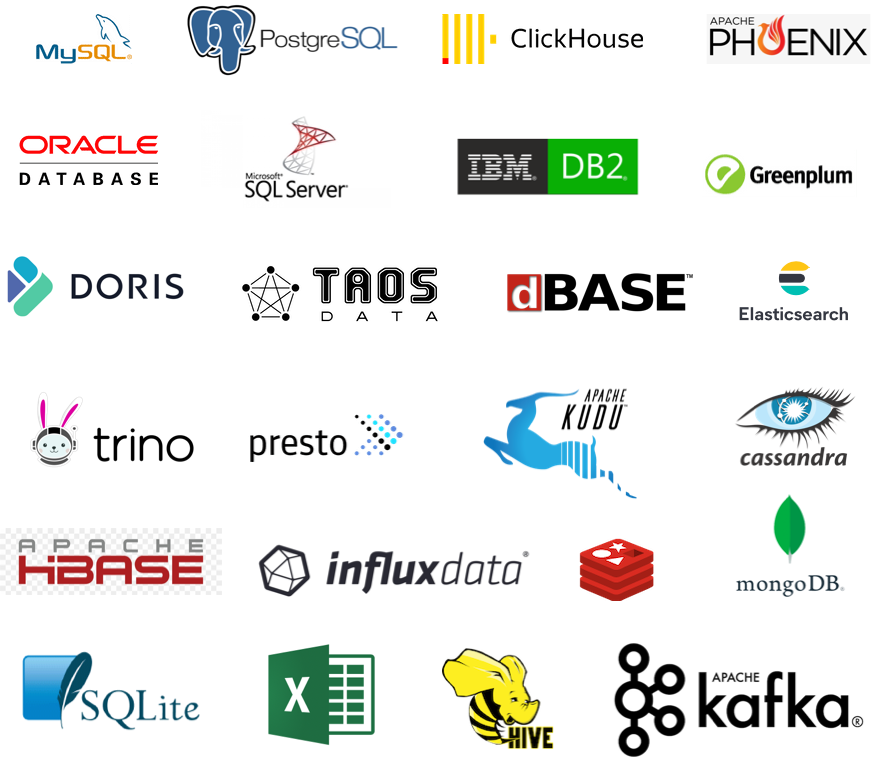

<p align="center">
    
</p>
<p align="center">Addax is an open source universal ETL tool</p>
<p align="center"><a href="https://wgzhao.github.io/Addax">Documentation</a> detailed description of how to install and deploy and how to use each collection plugin </p>
<p align="center">
   <a href="https://github.com/wgzhao/Addax/releases">
      
    </a>
   <a href="https://github.com/wgzhao/Addax/workflows/Maven%20Package/badge.svg">
       
   </a>
</p>

English | [简体中文](README_zh.md)

The project, originally from Ali's [DataX]((https://github.com/alibaba/datax)), has been streamlined and adapted, as described below

## Supported Data Sources

Addax supports more than 20 SQL and NoSQL [data sources](support_data_sources.md). It can also be extended to support more.



## Getting Started

### Use docker image

```shell
docker pull wgzhao/addax:latest
docker run -ti --rm --name addax wgzhao/addax:latest /opt/addax/bin/addax.sh /opt/addax/job/job.json
```

### Do not want to compile?

If you are too lazy to compile or cannot compile because of your environment, you can download the corresponding version from the [release](https://github.com/wgzhao/Addax/releases) page

### Compile and Package

```shell
git clone https://github.com/wgzhao/addax.git addax
cd addax
mvn clean package
mvn package assembly:single
```

If you want to compile the doc, you can execute the following instructions.

```shell
cd docs
mvn clean package
```

After successful compilation and packaging, a `addax-<version>` folder will be created in the `target/datax` directory of the project directory, where `<version` indicates the version.

### Begin your first task

The `job` subdirectory contains many sample jobs, of which `job.json` can be used as a smoke-out test and executed as follows

```shell
cd target/addax/addax-<version>
bin/addax.sh job/job.json
```

The output of the above command is roughly as follows.

<details>
<summary>Click to expand</summary>

```shell
$ bin/addax.sh job/job.json


  ___      _     _
 / _ \    | |   | |
/ /_\ \ __| | __| | __ ___  __
|  _  |/ _` |/ _` |/ _` \ \/ /
| | | | (_| | (_| | (_| |>  <
\_| |_/\__,_|\__,_|\__,_/_/\_\

:: Addax version ::    (v4.0.3)

2021-09-16 11:03:20.328 [        main] INFO  VMInfo               - VMInfo# operatingSystem class => sun.management.OperatingSystemImpl
2021-09-16 11:03:20.347 [        main] INFO  Engine               -
{
	"content":[
		{
			"reader":{
				"parameter":{
					"column":[
						{
							"type":"string",
							"value":"addax"
						},
						{
							"type":"long",
							"value":19890604
						},
						{
							"type":"date",
							"value":"1989-06-04 00:00:00"
						},
						{
							"type":"bool",
							"value":true
						},
						{
							"type":"bytes",
							"value":"test"
						}
					],
					"sliceRecordCount":10
				},
				"name":"streamreader"
			},
			"writer":{
				"parameter":{
					"print":true,
					"column":[
						"col1"
					],
					"encoding":"UTF-8"
				},
				"name":"streamwriter"
			}
		}
	],
	"setting":{
		"errorLimit":{
			"record":0,
			"percentage":0.02
		},
		"speed":{
			"byte":-1,
			"channel":1
		}
	}
}

2021-09-16 11:03:20.367 [        main] INFO  PerfTrace            - PerfTrace traceId=job_-1, isEnable=false, priority=0
2021-09-16 11:03:20.367 [        main] INFO  JobContainer         - Addax jobContainer starts job.
2021-09-16 11:03:20.368 [        main] INFO  JobContainer         - Set jobId = 0
2021-09-16 11:03:20.382 [       job-0] INFO  JobContainer         - Addax Reader.Job [streamreader] do prepare work .
2021-09-16 11:03:20.382 [       job-0] INFO  JobContainer         - Addax Writer.Job [streamwriter] do prepare work .
2021-09-16 11:03:20.383 [       job-0] INFO  JobContainer         - Job set Channel-Number to 1 channels.
2021-09-16 11:03:20.383 [       job-0] INFO  JobContainer         - Addax Reader.Job [streamreader] splits to [1] tasks.
2021-09-16 11:03:20.383 [       job-0] INFO  JobContainer         - Addax Writer.Job [streamwriter] splits to [1] tasks.
2021-09-16 11:03:20.405 [       job-0] INFO  JobContainer         - Scheduler starts [1] taskGroups.
2021-09-16 11:03:20.412 [ taskGroup-0] INFO  TaskGroupContainer   - taskGroupId=[0] start [1] channels for [1] tasks.
2021-09-16 11:03:20.415 [ taskGroup-0] INFO  Channel              - Channel set byte_speed_limit to -1, No bps activated.
2021-09-16 11:03:20.415 [ taskGroup-0] INFO  Channel              - Channel set record_speed_limit to -1, No tps activated.
addax	19890604	1989-06-04 00:00:00	true	test
addax	19890604	1989-06-04 00:00:00	true	test
addax	19890604	1989-06-04 00:00:00	true	test
addax	19890604	1989-06-04 00:00:00	true	test
addax	19890604	1989-06-04 00:00:00	true	test
addax	19890604	1989-06-04 00:00:00	true	test
addax	19890604	1989-06-04 00:00:00	true	test
addax	19890604	1989-06-04 00:00:00	true	test
addax	19890604	1989-06-04 00:00:00	true	test
addax	19890604	1989-06-04 00:00:00	true	test
2021-09-16 11:03:23.428 [       job-0] INFO  AbstractScheduler    - Scheduler accomplished all tasks.
2021-09-16 11:03:23.428 [       job-0] INFO  JobContainer         - Addax Writer.Job [streamwriter] do post work.
2021-09-16 11:03:23.428 [       job-0] INFO  JobContainer         - Addax Reader.Job [streamreader] do post work.
2021-09-16 11:03:23.430 [       job-0] INFO  JobContainer         - PerfTrace not enable!
2021-09-16 11:03:23.431 [       job-0] INFO  StandAloneJobContainerCommunicator - Total 10 records, 260 bytes | Speed 86B/s, 3 records/s | Error 0 records, 0 bytes |  All Task WaitWriterTime 0.000s |  All Task WaitReaderTime 0.000s | Percentage 100.00%
2021-09-16 11:03:23.432 [       job-0] INFO  JobContainer         -
任务启动时刻                    : 2021-09-16 11:03:20
任务结束时刻                    : 2021-09-16 11:03:23
任务总计耗时                    :                  3s
任务平均流量                    :               86B/s
记录写入速度                    :              3rec/s
读出记录总数                    :                  10
读写失败总数                    :                   0
```

</details>

[Here](core/src/main/job) and [Here](docs/assets/jobs) provides all kinds of job configuration examples

## Runtime Requirements

- JDK 1.8+
- Python 2.7+ / Python 3.7+ (Windows)

## Documentation

- [online](https://wgzhao.github.io/Addax/)
- [project](docs/index.md)

## Code Style

We recommend you use IntelliJ as your IDE. The code style template for the project can be found in the [codestyle](https://github.com/airlift/codestyle) repository along with our general programming and Java guidelines. In addition to those you should also adhere to the following:

* Alphabetize sections in the documentation source files (both in table of contents files and other regular documentation files). In general, alphabetize methods/variables/sections if such ordering already exists in the surrounding code.
* When appropriate, use the Java 8 stream API. However, note that the stream implementation does not perform well so avoid using it in inner loops or otherwise performance sensitive sections.
* Categorize errors when throwing exceptions. For example, PrestoException takes an error code as an argument, `PrestoException(HIVE_TOO_MANY_OPEN_PARTITIONS)`. This categorization lets you generate reports so you can monitor the frequency of various failures.
* Ensure that all files have the appropriate license header; you can generate the license by running `mvn license:format`.
* Consider using String formatting (printf style formatting using the Java `Formatter` class): `format("Session property %s is invalid: %s", name, value)` (note that `format()` should always be statically imported). Sometimes, if you only need to append something, consider using the `+` operator.
* Avoid using the ternary operator except for trivial expressions.
* Use an assertion from Airlift's `Assertions` class if there is one that covers your case rather than writing the assertion by hand. Over time we may move over to more fluent assertions like AssertJ.
* When writing a Git commit message, follow these [guidelines](https://chris.beams.io/posts/git-commit/).

## License

This software is free to use under the Apache License [Apache license](/LICENSE).


This project is supported by [JetBrains](https://jb.gg/OpenSource)
