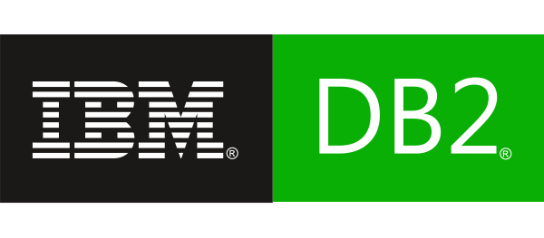
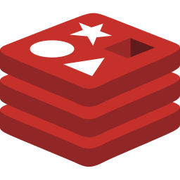
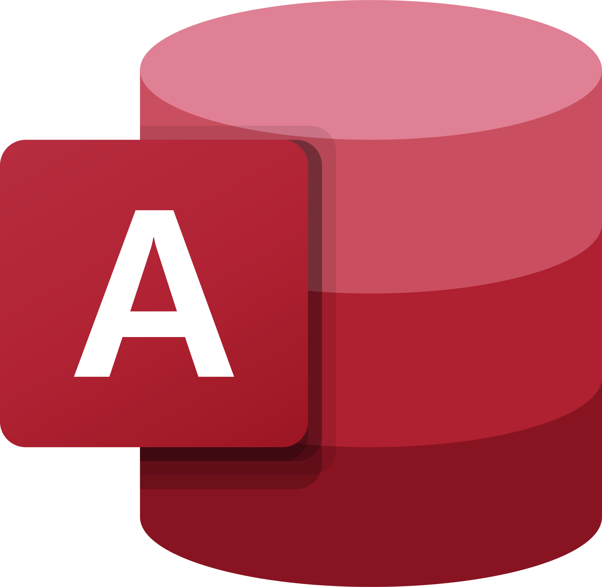

<p align="center">
    
</p>
<h1 align="center">Addax</h1>
<p align="center">
    <b>A versatile open-source ETL tool</b>
</p>
<p align="center">
Addax is an extensible ETL (Extract, Transform, Load) tool supporting over 20 SQL/NoSQL data sources, developed as a fork and evolution of Alibaba's <a href="https://github.com/alibaba/datax">DataX</a>. 
It provides a growing ecosystem of plugins and offers easy-to-follow configuration for data integrations.
</p>
<p align="center">
   <a href="https://github.com/wgzhao/Addax/releases">
      
   </a>
   <a href="https://github.com/wgzhao/Addax/workflows/Maven%20Package/badge.svg">
       
   </a>
</p>

[简体中文](README_zh.md)

---

## 🚀 Features

- Supports 20+ SQL and NoSQL data sources, and easily extendable for more.
- Configurable via simple JSON-based job descriptions.
- Actively maintained with improved architecture and added functionality compared to [DataX](https://github.com/alibaba/datax).
- Docker images for quick deployment.

---

## 📚 Documentation

Detailed instructions on installation, configuration, and usage are available:

- [Online Documentation](https://addax.wgzhao.com)
- [GitHub Docs](https://github.com/wgzhao/addax-docs)
- [Plugin Comparison](difference.md)

---

## 📦 Supported Data Sources

Addax supports a wide range of database systems and file sources. Below is a selection of supported platforms:

<table>
<tr>
<td></td>
<td></td>
<td></td>
<td></td>
</tr>
<tr>
<td></td>
<td></td>
<td></td>
<td></td>
</tr>
<tr>
<td></td>
<td></td>
<td></td>
<td></td>
</tr>
<tr>
<td></td>
<td></td>
<td></td>
<td></td>
</tr>
<tr>
<td></td>
<td></td>
<td></td>
<td></td>
</tr>
<tr>
<td></td>
<td></td>
<td></td>
<td></td>
</tr>
<tr>
<td></td>
<td></td>
<td></td>
<td></td>
</tr>
<tr>
<td></td>
<td></td>
<td></td>
<td></td>
</tr>
<tr>
<td></td>
</tr>
</table>

> **See the [full list](support_data_sources.md) of supported data sources**.

---

## 🛠️ Getting Started

Addax can be quickly installed and used via Docker, installation scripts, or compiled from source.

### 1. Use docker image

Pull the prebuilt Docker image and run a test job:

```shell
docker pull quay.io/wgzhao/addax:latest
docker run -ti --rm --name addax \
  quay.io/wgzhao/addax:latest \
  /opt/addax/bin/addax.sh /opt/addax/job/job.json
```

### 2. Use installation script

Install Addax with a single command:

```bash
/bin/bash -c "$(curl -fsSL https://raw.githubusercontent.com/wgzhao/Addax/master/install.sh)"
```

> Installation paths: /usr/local (macOS), /opt/addax/ (Linux).

### 3. Compile and Package from Source

- **Java Compiler**: JDK 17

For developers aiming to create custom-builds, compile and package Addax locally:

```shell
git clone https://github.com/wgzhao/addax.git addax
cd addax
export MAVEN_OPTS="-DskipTests -Dmaven.javadoc.skip=true -Dmaven.source.skip=true -Dgpg.skip=true"
mvn clean package
mvn package -Pdistribution
```

The compiled binary will be in `target/addax-<version>`.

### 4. Run Your First Task

Load sample job configuration and test the setup:

```bash
bin/addax.sh job/job.json
```

Explore more [example jobs](docs/assets/jobs)

---

## 📖 Runtime Requirements

- **Java Runtime**:  JDK 17
- **Python Version**: Python 2.7+ / 3.7+ (Windows only)

---

## 🔗 Related Projects

- [addax-admin](https://github.com/wgzhao/addax-admin) - A web-based management tool for administering Addax data collection tasks
- [addax-docs](https://github.com/wgzhao/addax-docs) - Comprehensive documentation for Addax, including user guides and API references
---

## 🧩 Developing Addax

For AI assistants: project-specific knowledge and conventions are documented in [SKILL.md](./SKILL.md). Please read it before working on this repo.

---

## Code Style Guidelines

Follow general Java conventions and patterns:

1. Use IntelliJ IDE with [Airlift's Code Style](https://github.com/airlift/codestyle)
2. Categorize exceptions clearly with AddaxException (e.g., `AddaxException(REQUIRE_VALUE, "missing required parameter")`).
3. Use the Java 8 Stream API cautiously (avoid in performance-sensitive areas).
4. Avoid ternary operators for non-trivial expressions.
5. Include proper Apache License headers in every file.

> Refer to our [Programming Guidelines](https://cbea.ms/git-commit/) for commit message formats.

---

## 🗓️ Versioning Scheme

This project adheres to the [Semantic Versioning (SemVer)](https://semver.org/) standard with the format `x.y.z`. The meanings of each segment are as follows:

- **z（Patch Version）**:
    - Bug fixes and performance improvements that do not affect compatibility with existing features.
    - Example: `1.2.3 → 1.2.4`

- **y（Minor Version）**:
    - Introducing new features or module adjustments that could break backward compatibility.
    - Example: `1.2.3 → 1.3.0`

- **x（Major Version）**:
    - Significant changes or new features that are often incompatible with previous versions.
    - Example: `1.3.0 → 2.0.0`

---

## 🌟 Star History

## Star History

<a href="https://www.star-history.com/#wgzhao/Addax&Date">
 <picture>
   <source media="(prefers-color-scheme: dark)" srcset="https://api.star-history.com/svg?repos=wgzhao/Addax&type=Date&theme=dark" />
   <source media="(prefers-color-scheme: light)" srcset="https://api.star-history.com/svg?repos=wgzhao/Addax&type=Date" />
   
 </picture>
</a>

--- 

## ⚖️ License

This software is free to use under the [Apache License 2.0](/LICENSE).

---

## 💌 Special Thanks

Special thanks to [JetBrains](https://jb.gg/OpenSource) for providing open-source support to this project.
