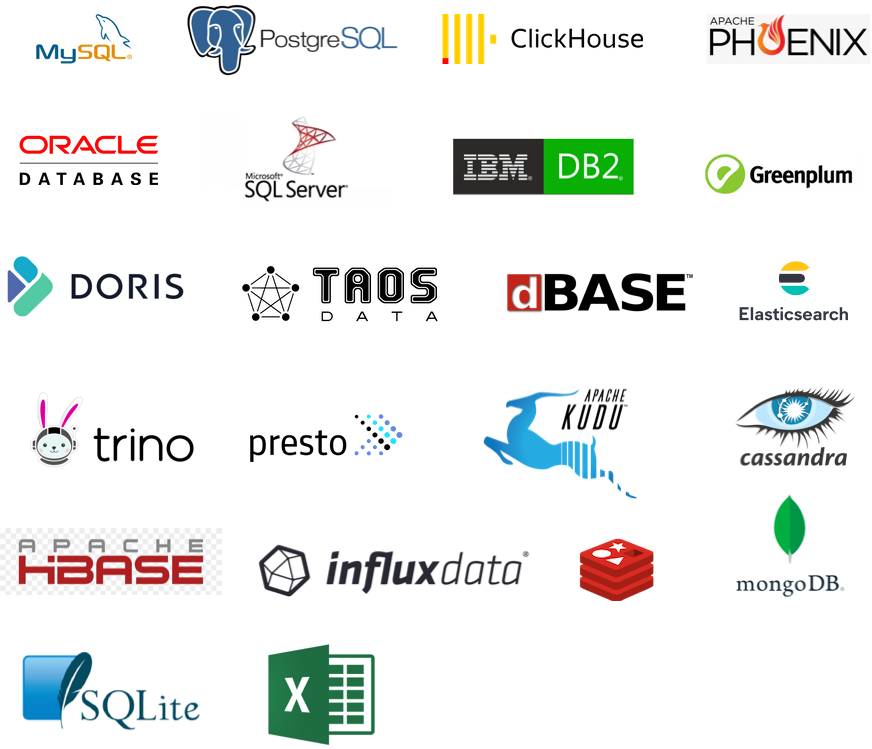

<p align="center">
    
</p>
<p align="center">Addax is an open source universal ETL tool</p>
<p align="center"><a href="https://addax.readthedocs.io">Documentation</a> detailed description of how to install and deploy and how to use each collection plugin </p>
<p align="center">
   <a href="https://github.com/wgzhao/addax/release">
      
    </a>
   <a href="https://github.com/wgzhao/Addax/workflows/Maven%20Package/badge.svg">
       
   </a>
   <a href="https://addax.readthedocs.io/zh_CN/latest/?badge=latest">
       
   </a>
</p>


English | [简体中文](README_zh.md)

The project, originally from Ali's [DataX]((https://github.com/alibaba/datax)), has been streamlined and adapted, as described below

## Supported databases



| database/filesystem | reader | writer | plugin(reader/writer)                   | memo                                                                          |
| ------------------- | ------ | ------ | --------------------------------------- | ------------------------------------------------------------------------------|
| Cassandra           | YES    | YES    | cassandrareader/cassandrawriter         |                                                                               |
| ClickHouse          | YES    | YES    | clickhousereader/clickhousewriter       |                                                                               |
| DB2                 | YES    | YES    | rbdmsreader/rdbmswriter                 | not fully tested                                                              |
| DBF                 | YES    | YES    | dbfreader/dbfwriter                     |                                                                               |
| ElasticSearch       | YES    | YES    | elasticsearchreader/elasticsearchwriter | originally from [@Kestrong](https://github.com/Kestrong/datax-elasticsearch)  |
| Excel               | YES    | YES    | excelreader/excelwriter                 |                                                                               |
| FTP                 | YES    | YES    | ftpreader/ftpwriter                     |                                                                               |
| HBase 1.x           | YES    | YES    | hbase11xreader/hbase11xwriter           | use HBASE API                                                                 |
| HBase 1.x           | YES    | YES    | hbase11xsqlreader/hbase11xsqlwriter     | use Phoenix[Phoenix](https://phoenix.apache.org)                              |
| HBase 2.x           | YES    | NO     | hbase20xreader                          | use HBase API                                                                 |
| HBase 2.x           | YES    | YES    | hbase20xsqlreader/hbase20xsqlwriter     | via [Phoenix](https://phoenix.apache.org)                                     |
| HDFS                | YES    | YES    | hdfsreader/hdfswriter                   | support HDFS 2.0 or later                                                     |
| HTTP                | YES    | NO     | httpreader                              | support RestFul API                                                           |
| Greenplum           | YES    | YES    | postgresqlreader/greenplumwriter        |                                                                               |
| InfluxDB            | YES    | YES    | influxdbreader/influxdbwriter           | ONLY support InfluxDB 1.x                                                     |
| json                | YES    | NO     | jsonfilereader                          |                                                                               |
| kudu                | YES    | YES    | kudureader/kuduwriter                   |                                                                               |
| MongoDB             | YES    | YES    | mongodbreader/mongodbwriter             |                                                                               |
| MySQL/MariaDB       | YES    | YES    | mysqlreader/mysqlwriter                 |                                                                               |
| Oracle              | YES    | YES    | oraclereader/oraclewriter               |                                                                               |
| PostgreSQL          | YES    | YES    | postgresqlreader/postgresqlwriter       |                                                                               |
| Trino               | YES    | YES    | rdbmsreader/rdbmswriter                 | [trino](https://trino.io)                                                     |
| Redis               | YES    | YES    | redisreader/rediswriter                 |                                                                               |
| SQLite              | YES    | YES    | sqlitereader/sqlitewriter               |                                                                               |
| SQL Server          | YES    | YES    | sqlserverreader/sqlserverwriter         |                                                                               |
| TDengine            | YES    | YES    | tdenginereader/tdenginewriter           | [TDengine](https://www.taosdata.com/cn/)                                      |
| TDH Inceptor2       | YES    | YES    | rdbmsreader/rdbmswriter                 | [Transwarp TDH](http://transwarp.cn/) 5.1 or later                            |
| TEXT                | YES    | YES    | textfilereader/textfilewriter           |                                                                               |

## Quick Started

### Use docker image

```shell
docker pull wgzhao/addax:latest
docker run -ti --rm --name addax wgzhao/addax:latest /opt/addax/bin/addax.sh /opt/addax/job/job.json
```

### Do not want to compile?

If you are too lazy to compile or cannot compile because of your environment, you can download the corresponding version from the following link

| version | download                                                   | md5                              |
| ------- | ---------------------------------------------------------- | -------------------------------- |
| 4.0.3   | https://www.aliyundrive.com/s/8CRAfMBbwfm                  | 19766c2577b46bd5b22d63a502f5f5dd |
| 4.0.2   | https://www.aliyundrive.com/s/U5uotY7vVAY                  | cd3a3d6d0c79cbd3bcd259ebb47acbc5 |
| 4.0.1   | https://www.aliyundrive.com/s/BwbUJr21baH                  | 8f1963e8ce5e5f880a29a503399413a6 |
| 4.0.0   | https://pan.baidu.com/s/1qmV6ed3CYpACIp29JCIDgQ code: 559q | b9b759da228f3bc656965d20357dcb2a |
| 3.2.5   | https://pan.baidu.com/s/14_MnbtRUtJlvQh8tTKv6fg code: 1jdr | 43ddd0186ccbaf1f1bfee0aac22da935 |
| 3.2.4   | https://pan.baidu.com/s/1VaOlAOTqGX4WwRtI5ewPeg code: i127 | 2d16125385b88405481e12bf4a8fd715 |
| 3.2.3   | https://pan.baidu.com/s/1ajjnSittf6u7rjXhJ7_3Aw code: qxry | ad47b0d840bf21de1668b9310a9782cf |
| 3.2.2   | https://pan.baidu.com/s/1TQyaERnIk9EQRDULfQE69w code: jh31 | b04d2563adb36457b85e48c318757ea3 |
| 3.2.1   | https://pan.baidu.com/s/1as6sL09HlxAN8b2pZ1DttQ code: hwgx | ecda4a961b032c75718502caf54246a8 |
| 3.1.9   | https://pan.baidu.com/s/1GYpehEvB-W3qnqilhskXFw code: q4wv | 48c4104294cd9bb0c749efc50b32b4dd |
| 3.1.8   | https://pan.baidu.com/s/1jv-tb-11grYaUnsgnEhDzw code: 2dnf | ef110ae1ea31e1761dc25d6930300485 |
| 3.1.7   | https://pan.baidu.com/s/1CE5I8V5TNptdOp6GLid3Jg code: v5u3 | fecca6c4a32f2bf7246fdef8bc2912fe |
| 3.1.6   | https://pan.baidu.com/s/1Ldg10E3qWkbUT44rkH19og code: 4av4 | f6aea7e0ce4b9ec83554e9c6d6ab3cb6 |
| 3.1.5   | https://pan.baidu.com/s/1yY_lJqulE6hKqktoQbbGmQ code: 2r4p | 9ae27c1c434a097f67a17bb704f70731 |
| 3.1.4   | https://pan.baidu.com/s/1_plsvzD_GrWN-HffPBtz-g code: kpjn | 7aca526fe7f6f0f54dc467f6ca1647b1 |
| 3.1.2   | https://pan.baidu.com/s/1zFqv8E6iJX549zdSZDQgiQ code: 7jdk | 3674711fc9b68fad3086f3c8526a3427 |
| 3.1.1   | https://pan.baidu.com/s/1GwmFA7-hPkd6GKiZEvUKXg code: 1inn | 0fa4e7902420704b2e814fef098f40ae |

**Note**: 
1. Starting from version `4.0.1`, the uploaded binary files have been switched from `Baidu Net Disk` to `Aliyun Drive`, and the download speed should be greatly improved
2. Starting from version `3.2.3`, in order to reduce the installation package size, the built-in package only includes `streamreader` and `streamwriter` plug-ins, 
other plug-ins need to be downloaded separately, the download shared directory list is as the following.
3. Because Aliyun drive does not support the sharing of compressed files currently, So, I add a .jpg suffix for each binary file, you need to remove this suffix before you can use them   

### Plugins download

| version | download link                                              |
| ------- | ---------------------------------------------------------- |
| 4.0.0   | https://pan.baidu.com/s/1gLWiw2I7W_4-KBiA1CCg2g code: hxag | 
| 3.2.5   | https://pan.baidu.com/s/1VMqPAYeL_kirCjOVAdvoAg code: hda9 |
| 3.2.4   | https://pan.baidu.com/s/1gPJlJh66bGQUSUR-2mNOQw code: 7c4j |
| 3.2.3   | https://pan.baidu.com/s/1g4z3Pqc_BxKstkiYjWXopQ code: 2fip |

### Compile and Package

```shell
git clone https://github.com/wgzhao/addax.git addax
cd addax
mvn clean package -pl '!:addax-docs'
mvn package assembly:single
```

If you want to compile the doc, you can execute the following instructions.

```shell
cd docs
mvn clean package
```

After successful compilation and packaging, a `addax-<version>` folder will be created in the `target/datax` directory of the project directory, where `<version` indicates the version.

### Begin your first task

The `job` subdirectory contains many sample jobs, of which `job.json` can be used as a smoke-out test and executed as follows

```shell
cd target/addax/addax-<version>
bin/addax.sh job/job.json
```

The output of the above command is roughly as follows.

<details>
<summary>Click to expand</summary>

```
 bin/addax.sh job/job.json

Addax (addax-V3), From Alibaba !
Copyright (C) 2010-2017, Alibaba Group. All Rights Reserved.


2020-09-23 19:51:30.990 [main] INFO  VMInfo - VMInfo# operatingSystem class => sun.management.OperatingSystemImpl
2020-09-23 19:51:30.997 [main] INFO  Engine - the machine info  =>

	osInfo:	Oracle Corporation 1.8 25.181-b13
	jvmInfo:	Mac OS X x86_64 10.15.6
	cpu num:	4

	totalPhysicalMemory:	-0.00G
	freePhysicalMemory:	-0.00G
	maxFileDescriptorCount:	-1
	currentOpenFileDescriptorCount:	-1

	GC Names	[PS MarkSweep, PS Scavenge]

	MEMORY_NAME                    | allocation_size                | init_size
	PS Eden Space                  | 677.50MB                       | 16.00MB
	Code Cache                     | 240.00MB                       | 2.44MB
	Compressed Class Space         | 1,024.00MB                     | 0.00MB
	PS Survivor Space              | 2.50MB                         | 2.50MB
	PS Old Gen                     | 1,365.50MB                     | 43.00MB
	Metaspace                      | -0.00MB                        | 0.00MB


2020-09-23 19:51:31.009 [main] INFO  Engine -
{
	"content":[
		{
			"reader":{
				"parameter":{
					"column":[
						{
							"type":"string",
							"value":"DataX"
						},
						{
							"type":"long",
							"value":19890604
						},
						{
							"type":"date",
							"value":"1989-06-04 00:00:00"
						},
						{
							"type":"bool",
							"value":true
						},
						{
							"type":"bytes",
							"value":"test"
						}
					],
					"sliceRecordCount":10
				},
				"name":"streamreader"
			},
			"writer":{
				"parameter":{
					"print":true,
					"column":[
						"col1"
					],
					"encoding":"UTF-8"
				},
				"name":"streamwriter"
			}
		}
	],
	"setting":{
		"errorLimit":{
			"record":0,
			"percentage":0.02
		},
		"speed":{
			"byte":-1,
			"channel":1
		}
	}
}

2020-09-23 19:51:31.068 [main] WARN  Engine - prioriy set to 0, because NumberFormatException, the value is: null
2020-09-23 19:51:31.069 [main] INFO  PerfTrace - PerfTrace traceId=job_-1, isEnable=false, priority=0
2020-09-23 19:51:31.069 [main] INFO  JobContainer - Addax jobContainer starts job.
2020-09-23 19:51:31.070 [main] INFO  JobContainer - Set jobId = 0
2020-09-23 19:51:31.082 [job-0] INFO  JobContainer - jobContainer starts to do prepare ...
2020-09-23 19:51:31.082 [job-0] INFO  JobContainer - Addax Reader.Job [streamreader] do prepare work .
2020-09-23 19:51:31.083 [job-0] INFO  JobContainer - Addax Writer.Job [streamwriter] do prepare work .
2020-09-23 19:51:31.083 [job-0] INFO  JobContainer - jobContainer starts to do split ...
2020-09-23 19:51:31.083 [job-0] INFO  JobContainer - Job set Channel-Number to 1 channels.
2020-09-23 19:51:31.083 [job-0] INFO  JobContainer - Addax Reader.Job [streamreader] splits to [1] tasks.
2020-09-23 19:51:31.084 [job-0] INFO  JobContainer - Addax Writer.Job [streamwriter] splits to [1] tasks.
2020-09-23 19:51:31.102 [job-0] INFO  JobContainer - jobContainer starts to do schedule ...
2020-09-23 19:51:31.111 [job-0] INFO  JobContainer - Scheduler starts [1] taskGroups.
2020-09-23 19:51:31.117 [taskGroup-0] INFO  TaskGroupContainer - taskGroupId=[0] start [1] channels for [1] tasks.
2020-09-23 19:51:31.119 [taskGroup-0] INFO  Channel - Channel set byte_speed_limit to -1, No bps activated.
2020-09-23 19:51:31.120 [taskGroup-0] INFO  Channel - Channel set record_speed_limit to -1, No tps activated.
2020-09-23 19:51:31.129 [taskGroup-0] INFO  TaskGroupContainer - taskGroup[0] taskId[0] attemptCount[1] is started
Addax	19890604	1989-06-04 00:00:00	true	test
Addax	19890604	1989-06-04 00:00:00	true	test
Addax	19890604	1989-06-04 00:00:00	true	test
Addax	19890604	1989-06-04 00:00:00	true	test
Addax	19890604	1989-06-04 00:00:00	true	test
Addax	19890604	1989-06-04 00:00:00	true	test
Addax	19890604	1989-06-04 00:00:00	true	test
Addax	19890604	1989-06-04 00:00:00	true	test
Addax	19890604	1989-06-04 00:00:00	true	test
Addax	19890604	1989-06-04 00:00:00	true	test
2020-09-23 19:51:31.231 [taskGroup-0] INFO  TaskGroupContainer - taskGroup[0] taskId[0] is successful, used[103]ms
2020-09-23 19:51:31.232 [taskGroup-0] INFO  TaskGroupContainer - taskGroup[0] completed it's tasks.
2020-09-23 19:51:41.129 [job-0] INFO  StandAloneJobContainerCommunicator - Total 10 records, 260 bytes | Speed 26B/s, 1 records/s | Error 0 records, 0 bytes |  All Task WaitWriterTime 0.000s |  All Task WaitReaderTime 0.000s | Percentage 100.00%
2020-09-23 19:51:41.130 [job-0] INFO  AbstractScheduler - Scheduler accomplished all tasks.
2020-09-23 19:51:41.130 [job-0] INFO  JobContainer - Addax Writer.Job [streamwriter] do post work.
2020-09-23 19:51:41.130 [job-0] INFO  JobContainer - Addax Reader.Job [streamreader] do post work.
2020-09-23 19:51:41.130 [job-0] INFO  JobContainer - Addax jobId [0] completed successfully.
2020-09-23 19:51:41.130 [job-0] INFO  JobContainer - invokeHooks begin
2020-09-23 19:51:41.130 [job-0] INFO  JobContainer - report url not found
2020-09-23 19:51:41.133 [job-0] INFO  JobContainer -
	 [total cpu info] =>
		averageCpu                     | maxDeltaCpu                    | minDeltaCpu
		-1.00%                         | -1.00%                         | -1.00%


	 [total gc info] =>
		 NAME                 | totalGCCount       | maxDeltaGCCount    | minDeltaGCCount    | totalGCTime        | maxDeltaGCTime     | minDeltaGCTime
		 PS MarkSweep         | 0                  | 0                  | 0                  | 0.000s             | 0.000s             | 0.000s
		 PS Scavenge          | 2                  | 2                  | 2                  | 0.006s             | 0.006s             | 0.006s

2020-09-23 19:51:41.133 [job-0] INFO  JobContainer - PerfTrace not enable!
2020-09-23 19:51:41.133 [job-0] INFO  StandAloneJobContainerCommunicator - Total 10 records, 260 bytes | Speed 26B/s, 1 records/s | Error 0 records, 0 bytes |  All Task WaitWriterTime 0.000s |  All Task WaitReaderTime 0.000s | Percentage 100.00%
2020-09-23 19:51:41.134 [job-0] INFO  JobContainer - Total 10 records, 260 bytes | Speed 26B/s, 1 records/s | Error 0 records, 0 bytes |  All Task WaitWriterTime 0.000s |  All Task WaitReaderTime 0.000s | Percentage 100.00%
2020-09-23 19:51:41.134 [job-0] INFO  JobContainer -
任务启动时刻                    : 2020-09-23 19:51:31
任务结束时刻                    : 2020-09-23 19:51:41
任务总计耗时                    :                 10s
任务平均流量                    :               26B/s
记录写入速度                    :              1rec/s
读出记录总数                    :                  10
读写失败总数                    :                   0
```

</details>

[Here](core/src/main/job) are some job configuration examples

## Runtime Requirements

- JDK 1.8+
- Python 2.7+ / Python 3.7+ (Windows)

## Documentation

- [online](https://addax.readthedocs.io)
- [project](docs/src/main/sphinx/index.rst)

## Code Style

We recommend you use IntelliJ as your IDE. The code style template for the project can be found in the [codestyle](https://github.com/airlift/codestyle) repository along with our general programming and Java guidelines. In addition to those you should also adhere to the following:

* Alphabetize sections in the documentation source files (both in table of contents files and other regular documentation files). In general, alphabetize methods/variables/sections if such ordering already exists in the surrounding code.
* When appropriate, use the Java 8 stream API. However, note that the stream implementation does not perform well so avoid using it in inner loops or otherwise performance sensitive sections.
* Categorize errors when throwing exceptions. For example, PrestoException takes an error code as an argument, `PrestoException(HIVE_TOO_MANY_OPEN_PARTITIONS)`. This categorization lets you generate reports so you can monitor the frequency of various failures.
* Ensure that all files have the appropriate license header; you can generate the license by running `mvn license:format`.
* Consider using String formatting (printf style formatting using the Java `Formatter` class): `format("Session property %s is invalid: %s", name, value)` (note that `format()` should always be statically imported). Sometimes, if you only need to append something, consider using the `+` operator.
* Avoid using the ternary operator except for trivial expressions.
* Use an assertion from Airlift's `Assertions` class if there is one that covers your case rather than writing the assertion by hand. Over time we may move over to more fluent assertions like AssertJ.
* When writing a Git commit message, follow these [guidelines](https://chris.beams.io/posts/git-commit/).

## License

This software is free to use under the Apache License [Apache license](/LICENSE).


This project is supported by [JetBrains](https://jb.gg/OpenSource)
