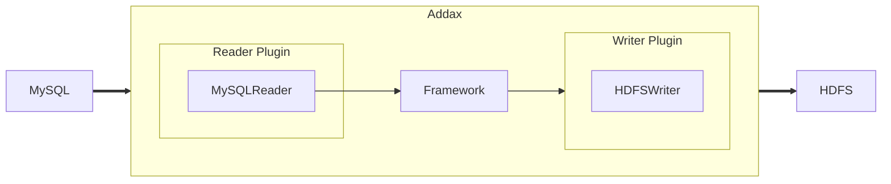
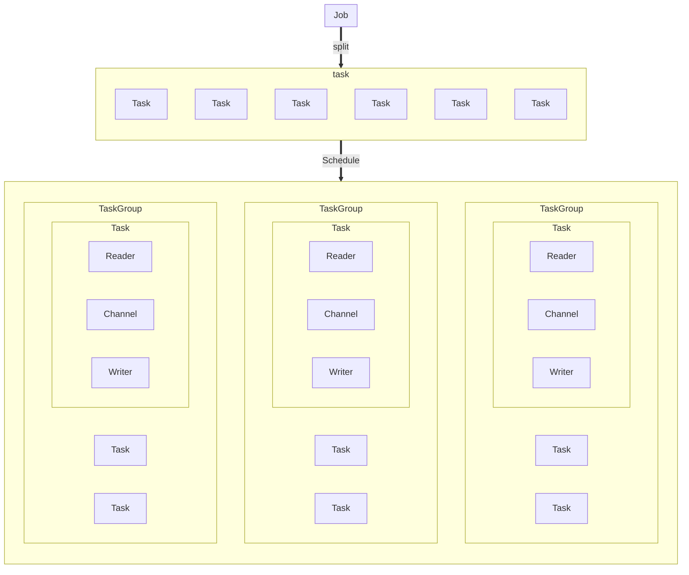

# Addax Introduction

## Overview

Addax is a heterogeneous data source offline synchronization tool originally derived from Alibaba's [DataX](https://github.com/alibaba/datax), dedicated to implementing stable and efficient data synchronization between various heterogeneous data sources including relational databases (MySQL, Oracle, etc.), HDFS, Hive, HBase, FTP, and more.


To solve the problem of heterogeneous data source synchronization, Addax transforms complex network synchronization links into star-shaped data links. Addax serves as the intermediate transmission carrier responsible for connecting various data sources. When a new data source needs to be integrated, you only need to connect this data source to Addax to achieve seamless data synchronization with existing data sources.

## Framework Design



Addax serves as an offline data synchronization framework, built with a Framework + plugin architecture. It abstracts data source reading and writing into Reader/Writer plugins, which are integrated into the entire synchronization framework.

- Reader: The Reader is the data collection module, responsible for collecting data from data sources and sending it to the Framework.
- Writer: The Writer is the data writing module, responsible for continuously fetching data from the Framework and writing it to the destination.
- Framework: The Framework connects Reader and Writer, serving as the data transmission channel between them, handling buffering, flow control, concurrency, data transformation, and other core technical issues.

Addax Framework provides simple interfaces for plugin interaction and a simple plugin integration mechanism. By simply adding a plugin, you can seamlessly connect to other data sources.

## Core Architecture

This section uses a sequence diagram of an Addax job lifecycle to briefly explain the relationships between various modules from an overall architectural design perspective.



### Core Module Introduction

1. Addax completes a single data synchronization job, which we call a Job. After Addax receives a Job, it will start a process to complete the entire job synchronization process. The Addax Job module is the central management node for a single job, responsible for data cleaning, sub-task splitting (converting a single job calculation into multiple sub-Tasks), TaskGroup management, and other functions.
2. After the Addax Job starts, it will split the Job into multiple small Tasks (sub-tasks) according to different source-side splitting strategies for concurrent execution. Task is the smallest unit of Addax jobs, and each Task is responsible for a portion of the data synchronization work.
3. After splitting multiple Tasks, the Addax Job will call the Scheduler module, which reorganizes the split Tasks into TaskGroups according to the configured concurrency. Each TaskGroup is responsible for running all assigned Tasks with a certain degree of concurrency. The default concurrency of a single task group is 5.
4. Each Task is started by the TaskGroup. After the Task starts, it will start the `Reader—>Channel—>Writer` thread to complete the task synchronization work.
5. After the Addax job runs, the Job monitors and waits for multiple TaskGroup modules to complete tasks. After all TaskGroup tasks are completed, the Job exits successfully. Otherwise, it exits abnormally with a non-zero exit code.

### Scheduling Process

For example, a user submitted a job configured with 20 concurrent threads, aiming to synchronize data from 100 MySQL sub-tables to Oracle. The scheduling decision logic is:

1. Addax Job splits into 100 Tasks based on database and table partitioning.
2. Based on 20 concurrent threads, it calculates that `20/5 = 4` TaskGroups need to be allocated.
3. The 4 TaskGroups evenly distribute the 100 split Tasks, with each TaskGroup responsible for running 25 Tasks with 5 concurrent threads.

## Core Advantages

### Reliable Data Quality Monitoring

- Perfect solution for data transmission type distortion issues

  Supports all strong data types, each plugin has its own data type conversion strategy, allowing data to be transmitted to the destination completely and without loss.

- Provides full-link traffic and data volume runtime monitoring for jobs

  During operation, comprehensive displays of job status, data traffic, data speed, execution progress, and other information can be provided, allowing users to understand job status in real-time. It can also intelligently compare the speed between source and destination during job execution, providing users with more performance troubleshooting information.

- Provides dirty data detection

  In the process of large-scale data transmission, many data transmission errors (such as type conversion errors) will inevitably occur due to various reasons. Addax considers such data as dirty data. Addax can currently achieve precise filtering, identification, collection, and display of dirty data, providing users with multiple dirty data processing modes to accurately control data quality!

### Rich Data Transformation Functions

As an ETL tool serving big data, in addition to providing data snapshot migration functions, it also provides rich data transformation functions, allowing data to easily complete data desensitization, completion, filtering, and other data transformation functions during transmission. It also provides automatic `groovy` functions, allowing users to customize transformation functions. For details, please see the [transformer](transformer.md) detailed introduction.

### Precise Speed Control

Provides three flow control modes including channel (concurrency), record flow, and byte flow, allowing you to control your job speed at will, letting your job achieve optimal synchronization speed within the range that the database can bear.

```json
{
  "speed": {
    "channel": 5,
    "byte": 1048576,
    "record": 10000
  }
}
```

### Strong Synchronization Performance

Each reader plugin has one or more splitting strategies, all of which can reasonably split jobs into multiple Tasks for parallel execution. The single-machine multi-threaded execution model can make speed increase linearly with concurrency.
When both source and destination performance are sufficient, a single job can definitely saturate the network card.

### Robust Error Tolerance Mechanism

Jobs are extremely susceptible to interference from external factors, and factors such as network interruptions and unstable data sources can easily cause synchronization jobs to report errors and stop halfway. Therefore, stability is a basic requirement for Addax. In the design of Addax, the stability of both framework and plugins has been improved.
Currently, Addax can achieve multi-level local/global retries at the thread level and job level, ensuring stable operation of user jobs.