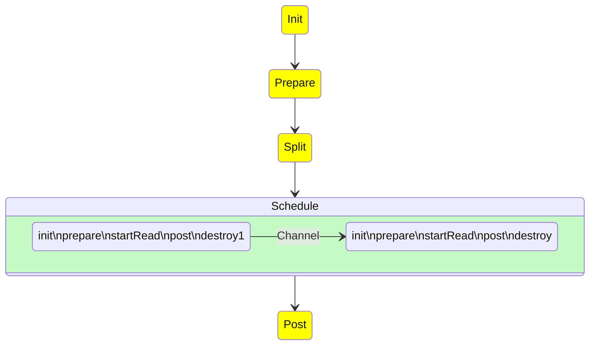
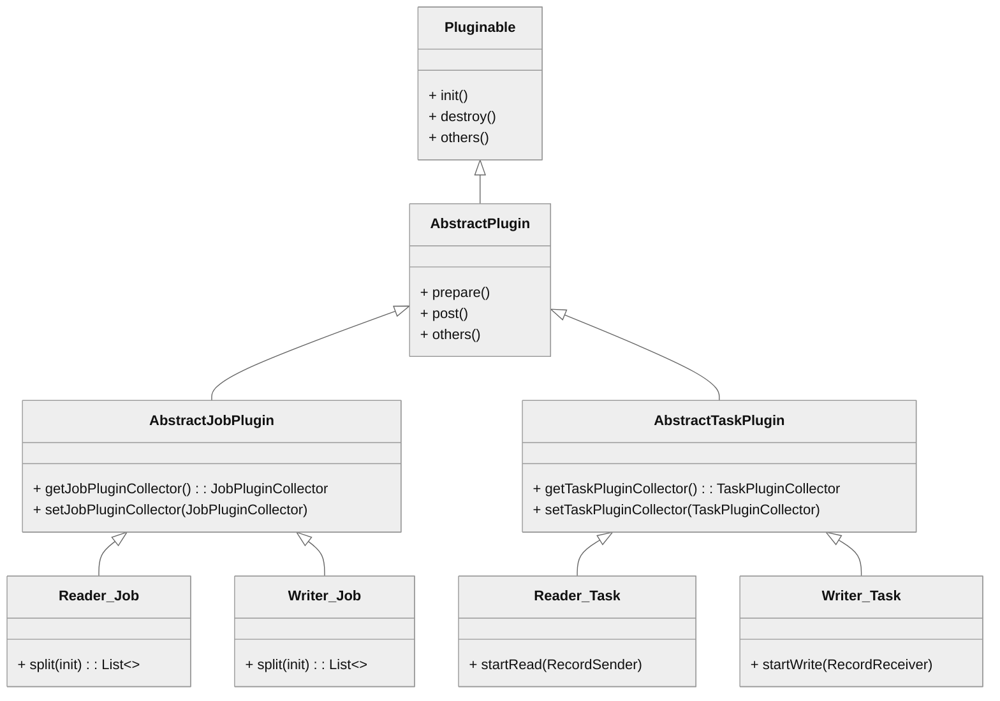
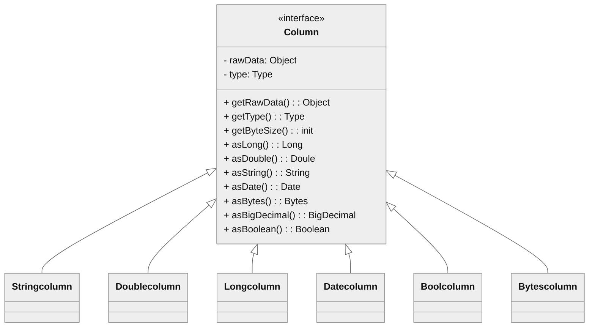

# Plugin Development

This guide is primarily for developers who need to develop Addax plugins to meet their specific needs.

## Addax Flow

The general process for running a task in Addax is as follows:


The startup steps are:

1.  Parse configurations, including `job.json`, `core.json`, and `plugin.json`.
2.  Set the `jobId` in the `configuration`.
3.  Start the Engine via `Engine.start()` to enter the startup procedure.
4.  Set the `RUNTIME_MODE` in the `configuration`.
5.  Start via the `JobContainer`'s `start()` method.
6.  Execute the job's `preHandler()`, `init()`, `prepare()`, `split()`, `schedule()`, `post()`, and `postHandle()` methods in sequence.
7.  The `init()` method involves initializing the reader and writer plugins based on the configuration. This includes hot-loading JAR packages and calling the plugin's `init()` method, as well as setting the reader and writer's configuration.
8.  The `prepare()` method involves initializing the reader and writer plugins by calling their respective `prepare()` methods. Each plugin has its own `jarLoader`, which inherits from `URLClassLoader`.
9.  The `split()` method adjusts the number of channels via `adjustChannelNumber()` and performs the most granular splitting for the reader and writer. It's important to note that the writer's split result must reference the reader's split result to ensure an equal number of splits, satisfying the 1:1 channel model.
10. The channel count is mainly determined by byte and record rate limiting, which is calculated as the first step in the `split()` function.
11. In the `split()` method, the reader plugin will split based on the channel value, but some reader plugins might not use this value. The writer plugin will always split 1:1 based on the reader's splits.
12. The `mergeReaderAndWriterTaskConfigs()` method inside `split()` is responsible for merging the configurations of the reader, writer, and transformer to generate task configurations and override the `job.content` configuration.
13. The `schedule()` method allocates and generates `TaskGroup` objects based on the task configurations generated by `split()`. The number of task groups is determined by dividing the total number of tasks by the number of tasks a single `TaskGroup` can support.
14. `schedule()` is executed internally by `AbstractScheduler`'s `schedule()` method, which then calls `startAllTaskGroup()` to create all `TaskGroupContainer`s to organize the related tasks. `TaskGroupContainerRunner` is responsible for running the `TaskGroupContainer` to execute the assigned tasks. The concrete implementation class for the scheduler is `ProcessInnerScheduler`.
15. `taskGroupContainerExecutorService` starts a fixed thread pool to execute `TaskGroupContainerRunner` objects. The `run()` method of `TaskGroupContainerRunner` calls `taskGroupContainer.start()`, which creates a `TaskExecutor` for each channel and starts the task via `taskExecutor.doStart()`.

## Plugin Mechanism

To handle the differences between various data sources while providing consistent synchronization primitives and extensibility, `Addax` uses a `Framework` + `Plugin` model:

-   Plugins only need to care about reading from or writing to the data source itself.
-   Common synchronization issues, such as type conversion, performance, and statistics, are handled by the framework.

As a plugin developer, you need to focus on two issues:

1.  The correctness of reading and writing data from the specific data source.
2.  How to communicate with the framework and use it correctly.

## Framework from a Plugin's Perspective

### Logical Execution Model

Plugin developers don't need to worry about too much; they mainly need to focus on reading from and writing to specific systems, and how their code is logically executed—which method is called and when. Before that, you need to understand the following concepts:

-   `Job`: Describes a synchronization job from a source to a destination, representing the smallest business unit of data synchronization. For example, synchronizing a table from MySQL to a table in PostgreSQL.
-   `Task`: The smallest execution unit, obtained by splitting a `Job` to maximize performance. For example, a `Job` reading from a sharded MySQL database with 1024 sub-tables can be split into 1024 read `Tasks`, executed concurrently.
-   `TaskGroup`: A collection of `Tasks`. A set of `Tasks` executed within the same `TaskGroupContainer` is called a `TaskGroup`.
-   `JobContainer`: The `Job` executor, a work unit responsible for the global splitting, scheduling, pre- and post-statements of a `Job`. Similar to the JobTracker in [Yarn][1].
-   `TaskGroupContainer`: The `TaskGroup` executor, a work unit responsible for executing a group of `Tasks`. Similar to the TaskTracker in [Yarn][1].

In short, a `Job` is split into `Tasks`, which are executed in containers provided by the framework. The plugin only needs to implement the logic for `Job` and `Task`.

## Programming Interface

So, how should the logic of `Job` and `Task` be mapped to specific code?

First, the entry class of a plugin must extend the `Reader` or `Writer` abstract class and implement their respective `Job` and `Task` inner abstract classes. The implementations of `Job` and `Task` must be in the form of **inner classes**.

```java
public class SomeReader
        extends Reader
{
    public static class Job
            extends Reader.Job
    {
        @Override
        public void init()
        {
        }

        @Override
        public void prepare()
        {
        }

        @Override
        public List<Configuration> split(int adviceNumber)
        {
            return null;
        }

        @Override
        public void post()
        {
        }

        @Override
        public void destroy()
        {
        }
    }

    public static class Task
            extends Reader.Task
    {

        @Override
        public void init()
        {
        }

        @Override
        public void prepare()
        {
        }

        @Override
        public void startRead(RecordSender recordSender)
        {
        }

        @Override
        public void post()
        {
        }

        @Override
        public void destroy()
        {
        }
    }
}
```

The `Job` interface functions are as follows:

-   `init`: Initialization work for the Job object. At this point, you can get the plugin-related configuration via `super.getPluginJobConf()`. The read plugin gets the `reader` section of the configuration, and the write plugin gets the `writer` section.
-   `prepare`: Global preparation work, such as clearing the target table in MySQL.
-   `split`: Splits the job into `Tasks`. The `adviceNumber` parameter is the number of splits suggested by the framework, usually the concurrency level configured at runtime. The return value is a list of `Task` configurations.
-   `post`: Global post-processing work, such as the `rename` operation for a MySQL writer after synchronizing to a shadow table.
-   `destroy`: Destruction work for the Job object itself.

The `Task` interface functions are as follows:

-   `init`: Initialization of the Task object. At this point, you can get the `Task`-related configuration via `super.getPluginJobConf()`. This configuration is one of the configurations returned by the `Job#split` method.
-   `prepare`: Local preparation work.
-   `startRead`: Reads data from the data source and writes it to the `RecordSender`. The `RecordSender` writes the data to the buffer queue connecting the `Reader` and `Writer`.
-   `startWrite`: Reads data from the `RecordReceiver` and writes it to the target data source. The data in the `RecordReceiver` comes from the buffer queue between the `Reader` and `Writer`.
-   `post`: Local post-processing work.
-   `destroy`: Destruction work for the Task object itself.

Please note:

-   There must be no shared variables between `Job` and `Task`, because in a distributed runtime, there is no guarantee that shared variables will be initialized correctly. They can only depend on each other through configuration files.
-   `prepare` and `post` exist in both `Job` and `Task`. The plugin needs to determine where to perform operations based on the actual situation.

The framework executes the `Job` and `Task` interfaces in the following order:



In the diagram above, yellow represents the execution phase of the `Job` part, gray represents the execution phase of the `Task` part, and green represents the framework's execution phase.

The related class relationships are as follows:



### Plugin Definition

In each plugin's project, there is a `plugin.json` file that defines the plugin's information, including its entry class. For example:

```json
{
  "name": "mysqlwriter",
  "class": "com.wgzhao.addax.plugin.writer.mysqlwriter.MysqlWriter",
  "description": "Use Jdbc connect to database, execute insert sql.",
  "developer": "wgzhao"
}
```

-   `name`: The plugin name, case-sensitive. The framework searches for the plugin based on the name specified by the user in the configuration file. **Very important**.
-   `class`: The fully qualified name of the entry class. The framework creates an instance of the entry class via reflection. **Very important**.
-   `description`: Descriptive information.
-   `developer`: The developer.

### Packaging and Publishing

`Addax` uses `assembly` for packaging. The packaging commands are as follows:

```bash
mvn clean package
mvn package assembly:single
```

`Addax` plugins need to follow a uniform directory structure:

```ini
${ADDAX_HOME}
├── bin
│     ├── addax.sh
├── conf
│     ├── core.json
│     └── logback.xml
├── job
├── lib
│     ├── addax-common-<version>.jar
│     ├── addax-core-<version>.jar
│     ├── addax-rdbms-<version>.jar
│     ├── addax-storage-<version>.jar
├── log
├── plugin
│     ├── reader
│     │     ├── cassandrareader
│     │     │     ├── cassandrareader-<version>.jar
│     │     │     ├── libs
│     │     │     │     ├── <symbol link to shared folder>
│     │     │     ├── plugin.json
│     │     │     └── plugin_job_template.json
│     └── writer
│         ├── cassandrawriter
│         │     ├── cassandrawriter-<version>.jar
│         │     ├── libs
│         │     │     ├── <symbol link to shared folder>
│         │     ├── plugin.json
│         │     └── plugin_job_template.json
├── shared
```

-   `${ADDAX_HOME}/bin`: Executable program directory
-   `${ADDAX_HOME}/conf`: Framework configuration directory
-   `${ADDAX_HOME}/lib`: Framework dependency library directory
-   `${ADDAX_HOME}/shared`: Plugin dependency directory
-   `${ADDAX_HOME}/plugin`: Plugin directory

The plugin directory is divided into `reader` and `writer` subdirectories, where read and write plugins are stored respectively. The plugin directory structure is as follows:

-   `${PLUGIN_HOME}/libs`: The plugin's dependency libraries. To reduce package size, these dependencies are symbolic links to the `shared` directory.
-   `${PLUGIN_HOME}/plugin-name-version.jar`: The plugin's own jar file.
-   `${PLUGIN_HOME}/plugin.json`: The plugin description file.

Although the framework adds all jar files under `${PLUGIN_HOME}` to the `classpath` when loading the plugin, it is recommended to keep dependency library jars and the plugin's own jar separate.

!!! Special Reminder

    The plugin's directory name must be consistent with the plugin name defined in `plugin.json`.

## Configuration File

`Addax` uses `json` as the format for configuration files. A typical `Addax` task configuration is as follows:

```json
--8<-- "jobs/pgwriter.json"
```

The `Addax` framework has a `core.json` configuration file that specifies the framework's default behavior. A task's configuration can specify configuration items that already exist in the framework, and these will have a higher priority, overriding the settings in `core.json`.

The `value` part of `job.content.reader.parameter` in the configuration is passed to `Reader.Job`; the `value` part of `job.content.writer.parameter` is passed to `Writer.Job`. `Reader.Job` and `Writer.Job` can retrieve them using `super.getPluginJobConf()`.

### How to Design Configuration Parameters

> Designing the configuration file is the first step in plugin development!

The `parameter` section under `reader` and `writer` in the task configuration contains the plugin's configuration parameters. These parameters should follow these principles:

-   Camel Case: All configuration items should use lower camel case, with the first letter being lowercase.
-   Orthogonality Principle: Configuration items must be orthogonal, with no overlapping functionality or hidden rules.
-   Rich Types: Use JSON types appropriately to reduce unnecessary processing logic and the possibility of errors.
    -   Use the correct data types. For example, for a `bool` type, use `true`/`false` instead of `"yes"`/`"true"`/`0`.
    -   Use collection types reasonably, for example, use an array instead of a delimited string.
-   Consistency with Similar Plugins: Follow the conventions of similar plugin types. For example, the `connection` parameter for relational databases usually has the following structure:

  ```json
  {
    "connection": [
      {
        "table": ["table_1", "table_2"],
        "jdbcUrl": [
          "jdbc:mysql://127.0.0.1:3306/database_1",
          "jdbc:mysql://127.0.0.2:3306/database_1_slave"
        ]
      },
      {
        "table": ["table_3", "table_4"],
        "jdbcUrl": [
          "jdbc:mysql://127.0.0.3:3306/database_2",
          "jdbc:mysql://127.0.0.4:3306/database_2_slave"
        ]
      }
    ]
  }
  ```

### How to Use the `Configuration` Class

To simplify operations on `json`, `Addax` provides a simple DSL to be used with the `Configuration` class.

`Configuration` provides common operations for reading and writing configuration items, such as `get`, `get with type`, `get with default value`, and `set`, as well as methods like `clone` and `toJSON`. Read and write operations require a `path` parameter.

1.  A child map is represented by `.key`. The first dot in the `path` is omitted.
2.  An array element is represented by `[index]`.

For example, to operate on the following json:

```json
{
  "a": {
    "b": {
      "c": 2
    },
    "f": [
      1,
      2,
      {
        "g": true,
        "h": false
      },
      4
    ]
  },
  "x": 4
}
```

When calling the `configuration.get(path)` method, the results for the following path values are:

-   `x`: `4`
-   `a.b.c`: `2`
-   `a.b.c.d`: `null`
-   `a.f[0]`: `1`
-   `a.f[2].g`: `true`

Note that because the configuration seen by the plugin is only a part of the whole configuration, you need to be aware of the current root path when using a `Configuration` object.

For more operations on `Configuration`, please refer to [Configuration.java][2].

## Plugin Data Transfer

Like the general `producer-consumer` model, `Reader` and `Writer` plugins also transfer data through a `channel`. The `channel` can be in-memory or persistent.

A piece of data in the `channel` is a `Record` object. A `Record` can contain multiple `Column` objects, which can be simply understood as records and columns in a database.

`Record` has the following methods:

```java
public interface Record
{
    // Add a column to the end
    void addColumn(Column column);

    // Set a column at a specific index
    void setColumn(int i, final Column column);

    // Get a column
    Column getColumn(int i);

    // Convert to a JSON String
    String toString();

    // Get the total number of columns
    int getColumnNumber();

    // Calculate the byte size of the entire record in memory
    int getByteSize();
}
```

Since `Record` is an interface, the `Reader` plugin first calls `RecordSender.createRecord()` to create a `Record` instance, and then adds `Column`s one by one to the `Record`.

The `Writer` plugin calls the `RecordReceiver.getFromReader()` method to get a `Record`, then iterates through the `Column`s and writes them to the target storage. When the `Reader` has not yet exited and the transfer is still in progress, if `getFromReader()` returns `null`, it means there is currently no data in the channel.
If the transfer has already ended, it will return `null`, and the `Writer` plugin can use this to determine whether to end the `startWrite` method.

## Type Conversion

To standardize type conversion operations between the source and destination and ensure data integrity, Addax supports six internal data types:

-   `Long`: Fixed-point numbers (Int, Short, Long, BigInteger, etc.).
-   `Double`: Floating-point numbers (Float, Double, BigDecimal (infinite precision), etc.).
-   `String`: String type, with no length limit, using a universal character set (Unicode).
-   `Date`: Date type.
-   `Timestamp`: Timestamp type.
-   `Bool`: Boolean value.
-   `Bytes`: Binary data, which can store unstructured data such as MP3s.

Correspondingly, there are seven `Column` implementations: `DateColumn`, `LongColumn`, `DoubleColumn`, `BytesColumn`, `StringColumn`, `BoolColumn`, and `TimestampColumn`.

In addition to providing data-related methods, `Column` also provides a series of type conversion methods starting with `as`.



Addax's internal types use different Java types in their implementation:

| Internal Type | Implementation Type  | Notes                            |
|---------------|----------------------|----------------------------------|
| Date          | java.util.Date       |                                  |
| Timestamp     | java.sql.Timestamp   | Can be precise to the nanosecond |
| Long          | java.math.BigInteger | Uses infinite-precision integers to ensure no loss of precision |
| Double        | java.lang.String     | Represented as a String to ensure no loss of precision |
| Bytes         | byte[]               |                                  |
| String        | java.lang.String     |                                  |
| Bool          | java.lang.Boolean    |                                  |

The relationships for converting between types are as follows:

| from/to | Date                    | Long                     | Double                       | Bytes                        | String                     | Bool                                        |
|---------|-------------------------|--------------------------|------------------------------|------------------------------|----------------------------|---------------------------------------------|
| Date    | -                       | Use millisecond timestamp| Not supported                | Not supported                | Convert according to configured format | Not supported |
| Long    | Construct Date from ms  | -                        | `BigDecimal.doubleValue()`   | Not supported                | `BigInteger.toString()`    | 0 is `false`, others are `true` |
| Double  | Not supported           | `BigDecimal.longValue()` | -                            | Not supported                | Return internal String directly | Not supported |
| Bytes   | Not supported           | Not supported            | Not supported                | -                            | Convert to `byte[]` with UTF-8 encoding | Not supported |
| String  | Parse with configured format | `BigDecimal.longValue`   | `BigDecimal.doubleValue`[^1] | Convert to `byte[]` with UTF-8 encoding[^2] | -                          | "true" is `true`, "false" is `false` |
| Bool    | Not supported           | `true` is `1L`, else `0L`| `true` is `1.0`, else `0.0`  | Not supported                | `Boolean.toString()`       | -                          |

## Dirty Data Handling

### What is Dirty Data

Currently, there are three main types of dirty data:

1.  The Reader reads an unsupported type or an illegal value.
2.  Unsupported type conversion, for example, converting `Bytes` to `Date`.
3.  Writing to the target fails, for example, an integer value exceeds the length limit when writing to MySQL.

### How to Handle Dirty Data

In `Reader.Task` and `Writer.Task`, you can get a `TaskPluginCollector` through `AbstractTaskPlugin.getPluginCollector()`. It provides a series of `collectDirtyRecord` methods. When dirty data is encountered, you can call this method and pass in the `Record` that is considered dirty.

Users can specify a limit on the number of dirty data records or a percentage limit in the task configuration. When the dirty data exceeds the limit, the framework will terminate the synchronization task. Plugins need to ensure that all dirty data is collected.

## Loading Principle

1.  The framework scans the `plugin/reader` and `plugin/writer` directories and loads each plugin's `plugin.json` file.
2.  It indexes all plugin configurations using the `name` from the `plugin.json` file as the key. If duplicate plugin names are found, the framework will exit with an error.
3.  The user specifies the plugin name in the `name` field of the `reader`/`writer` configuration. The framework then scans all jars in the plugin's path based on the plugin type (`reader`/`writer`) and name, and adds them to a custom `classloader`.
4.  Based on the entry class defined in the plugin configuration, the framework instantiates the corresponding `Job` and `Task` objects via reflection.

[1]: https://hadoop.apache.org/docs/stable/hadoop-yarn/hadoop-yarn-site/YARN.html
[2]: https://github.com/wgzhao/Addax/blob/master/common/src/main/java/com/wgzhao/addax/common/util/Configuration.java

[^1]: Handles values like `NaN`, `Infinity`, `-Infinity`.
[^2]: Unless another encoding format is specified.