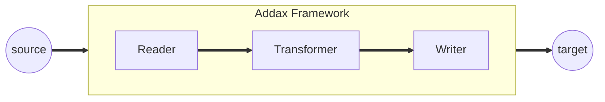

# Data Transformation

## Transformer Definition

During data synchronization and transmission, users may have customized requirements for data processing, such as trimming columns or transforming column values. This can be achieved through the T (Transformer) process in ETL. Addax includes a Transformer module that allows for flexible data transformation by defining a series of UDFs (User-Defined Functions).

## Execution Model



## UDF Functions

### dx_substr

`dx_substr(idx, pos, length) -> str`

**Parameters**

- `idx`: The index of the field in the record.
- `pos`: The starting position within the field's value.
- `length`: The length of the target substring.

**Returns:** A substring of the specified length from the specified starting position (inclusive). An exception is thrown if the starting position is invalid. If the field is null, it is returned directly (i.e., this transformer does not process it).

### dx_pad

`dx_pad(idx, flag, length, chr)`

**Parameters**

- `idx`: The index of the field in the record.
- `flag`: "l" or "r", indicating whether to pad at the beginning (left) or the end (right).
- `length`: The target length of the field.
- `chr`: The character to use for padding.

**Returns:** If the source string's length is less than the target length, it returns the string after padding. If it's longer, it is truncated (always from the right). If the field is null, it is converted to an empty string before padding.

**Examples:**

- `dx_pad(1, "l", "4", "A")`: If `column 1`'s value is `xyz`, the transformed value is `Axyz`. If the value is `xyzzzzz`, it becomes `xyzz`.
- `dx_pad(1, "r", "4", "A")`: If `column 1`'s value is `xyz`, the transformed value is `xyzA`. If the value is `xyzzzzz`, it becomes `xyzz`.

### dx_replace

`dx_replace(idx, pos, length, str) -> str`

**Parameters**

- `idx`: The index of the field in the record.
- `pos`: The starting position within the field's value.
- `length`: The length of the substring to be replaced.
- `str`: The string to replace with.

**Returns:** Replaces a substring of a specified length from a specified starting position (inclusive). An exception is thrown if the starting position is invalid. If the field is null, it is returned directly (i.e., this transformer does not process it).

**Examples:**

- `dx_replace(1, "2", "4", "****")`: If `column 1`'s value is `addaxTest`, it is transformed to `da****est`.
- `dx_replace(1, "5", "10", "****")`: If `column 1`'s value is `addaxTest`, it is transformed to `data****`.

### dx_filter

`dx_filter(idx, operator, expr) -> str`

**Parameters:**

- `idx`: The index of the field in the record.
- `operator`: The operator. Supported operators are `like`, `not like`, `>`, `=`, `<`, `>=`, `!=`, `<=`.
- `expr`: A regular expression (Java-style) or a value.

**Returns:**

- If the condition is met, it returns `null`, which filters out the entire row. If the condition is not met, the row is kept.
- `like` and `not like`: The field is converted to a string and then fully matched against the target regular expression.
- `>`, `=`, `<`, `>=`, `!=`, `<=`: Comparison is performed based on the data type. Numeric types are compared by value; string and boolean types are compared lexicographically.
- If the target field is `null`, it will satisfy the `= null` filter condition and be filtered out. For the `!= null` condition, `null` does not satisfy the filter condition and is not filtered. For `like`, if the field is `null`, it is not filtered.

**Examples:**

- `dx_filter(1, "like", "dataTest")`
- `dx_filter(1, ">=", "10")`

Compound filters (i.e., conditions involving multiple fields) are not currently supported as the function parameters would be too complex for users.

### dx_groovy

`dx_groovy(code, package) -> record`

**Parameters**

- `code`: Code that conforms to Groovy syntax.
- `package`: `extraPackage`, which can be a list or empty.

**Returns**

A `Record` data type.

**Notes:**

- `dx_groovy` can only be called once per transformer configuration. Multiple calls are not allowed.
- The `groovy code` supports packages from `java.lang` and `java.util`. Objects that can be directly referenced include `record` and various column types under `element` (BoolColumn.class, BytesColumn.class, DateColumn.class, DoubleColumn.class, LongColumn.class, StringColumn.class). Other packages are not supported by default. If you need to use other packages, you can set `extraPackage`. Note that `extraPackage` does not support third-party JARs.
- In the `groovy code`, you must return the updated `Record` (e.g., `record.setColumn(columnIndex, new StringColumn(newValue));`) or `null`. Returning `null` filters out the current row.
- You can directly call static utility methods (GroovyTransformerStaticUtil).

**Examples:**

Groovy implementation of `subStr`:

```java
String code="Column column = record.getColumn(1);\n"+
        " String oriValue = column.asString();\n"+
        " String newValue = oriValue.substring(0, 3);\n"+
        " record.setColumn(1, new StringColumn(newValue));\n"+
        " return record;";
dx_groovy(code); // Note: The original doc had `dx_groovy(record)` which is incorrect. It should be the code string.
```

Groovy implementation of `replace`:

```java
String code2="Column column = record.getColumn(1);\n"+
        " String oriValue = column.asString();\n"+
        " String newValue = \"****\" + oriValue.substring(3, oriValue.length());\n"+
        " record.setColumn(1, new StringColumn(newValue));\n"+
        " return record;";
```

Groovy implementation of `pad`:

```java
String code3="Column column = record.getColumn(1);\n"+
        " String oriValue = column.asString();\n"+
        " String padString = \"12345\";\n"+
        " String finalPad = \"\";\n"+
        " int NeedLength = 8 - oriValue.length();\n"+
        "        while (NeedLength > 0) {\n"+
        "\n"+
        "            if (NeedLength >= padString.length()) {\n"+
        "                finalPad += padString;\n"+
        "                NeedLength -= padString.length();\n"+
        "            } else {\n"+
        "                finalPad += padString.substring(0, NeedLength);\n"+
        "                NeedLength = 0;\n"+
        "            }\n"+
        "        }\n"+
        " String newValue= finalPad + oriValue;\n"+
        " record.setColumn(1, new StringColumn(newValue));\n"+
        " return record;";
```

Starting from version `4.1.2`, `dx_groovy` supports loading Groovy code from an external file. The file is read relative to the `$ADDAX_HOME` directory, which is the installation directory of Addax.

For example, to implement `subStr`, you can create a file `job/substr.groovy` with the following content:

```groovy
Column column = record.getColumn(1)
String oriValue = column.asString()
String newValue = oriValue.substring(0, 3)
record.setColumn(1, new StringColumn(newValue))
return record
```

Then, define it in the `job` file like this:

```json
{
  "transformer": [
    {
      "name": "dx_groovy",
      "parameter": {
        "codeFile": "job/substr.groovy"
      }
    }
  ]
}
```

You can also specify an absolute path for the file.

## Job Definition

In this example, four UDFs are configured.

```json
--8<-- "jobs/udfdemo.json"
```

## Custom Functions

If the built-in functions do not meet your data transformation requirements, you can write code that conforms to Groovy specifications within the `transformer`. Here is a complete example:

```json
--8<-- "jobs/groovy.json"
```

The `transformer` code above modifies the first two fields of each record. It adds the prefix `Header_` to the first string field and doubles the value of the second integer field. The execution result is as follows:

```shell
--8<-- "output/groovydemo.txt"
```

## Metrics and Dirty Data

The Transform process involves data conversion, which may increase or decrease the amount of data. Therefore, precise metrics are needed, including:

- Number of input records and bytes for the Transform.
- Number of output records and bytes from the Transform.
- Number of dirty data records and bytes from the Transform.
- If there are multiple Transforms, and one of them generates dirty data, subsequent transforms will not be executed for that record, and it will be directly counted as dirty data.
- Currently, only overall metrics for all Transforms are provided (success, failure, filtered counts, and time consumed by the transform).

The metrics displayed during the process are defined as follows:

```shell
Total 1000000 records, 22000000 bytes | Transform 100000 records(in), 10000 records(out) | Speed 2.10MB/s, 100000 records/s | Error 0 records, 0 bytes | Percentage 100.00%
```

Note: This mainly records the input and output of the transformation, which requires monitoring changes in the number of data records.

The final job metrics are displayed as follows:

```shell
Job start  at             : 2025-07-23 09:08:26
Job end    at             : 2025-07-23 09:08:29
Job took secs             :                  3s
Average   bps             :              110B/s
Average   rps             :              3rec/s
Number of rec             :                  10
Failed record             :                   0
Transformer success records:                  10
Transformer failed  records:                   0
Transformer filter  records:                   0
```

Note: This mainly records the input and output of the transformation, which requires monitoring changes in the number of data records.