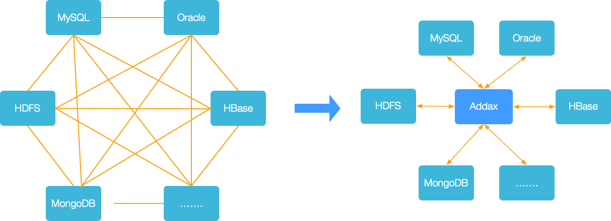
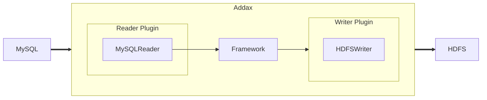
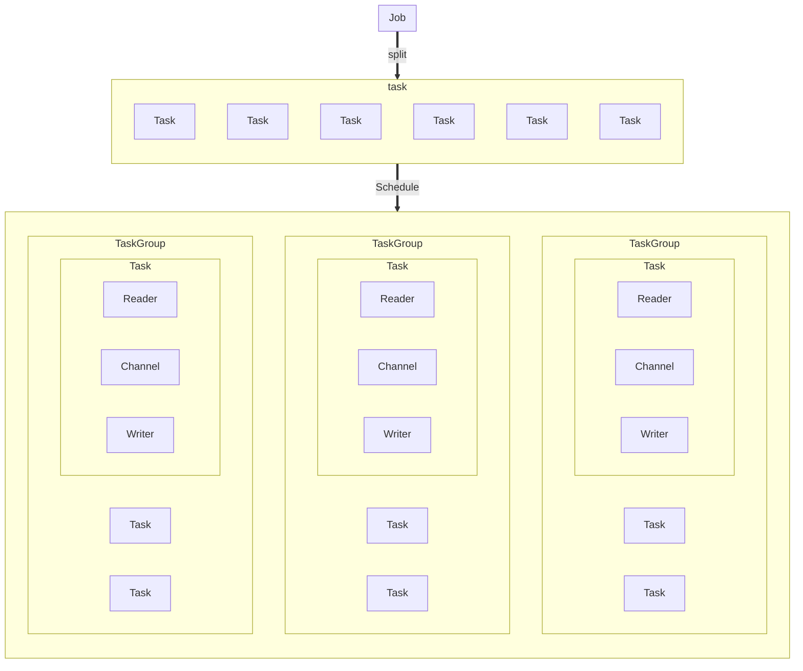

# Addax 介绍

## 概览

Addax 是一个异构数据源离线同步工具，最初来源于阿里的 [DataX](https://github.com/alibaba/datax) ，致力于实现包括关系型数据库(MySQL、Oracle 等)、HDFS、Hive、HBase、FTP 等各种异构数据源之间稳定高效的数据同步功能。



为了解决异构数据源同步问题，Addax 将复杂的网状的同步链路变成了星型数据链路，Addax 作为中间传输载体负责连接各种数据源。当需要接入一个新的数据源的时候，只需要将此数据源对接到 Addax，便能跟已有的数据源做到无缝数据同步。

## 框架设计



Addax 本身作为离线数据同步框架，采用 Framework + plugin 架构构建。将数据源读取和写入抽象成为 Reader/Writer 插件，纳入到整个同步框架中。

- Reader：Reader 为数据采集模块，负责采集数据源的数据，将数据发送给 Framework。
- Writer： Writer 为数据写入模块，负责不断向 Framework 取数据，并将数据写入到目的端。
- Framework：Framework 用于连接 reader 和 writer，作为两者的数据传输通道，并处理缓冲，流控，并发，数据转换等核心技术问题。

Addax Framework 提供了简单的接口与插件交互，提供简单的插件接入机制，只需要任意加上一种插件，就能无缝对接其他数据源。

## 核心架构

本小节按一个 Addax 作业生命周期的时序图，从整体架构设计非常简要说明各个模块相互关系。



### 核心模块介绍

1. Addax 完成单个数据同步的作业，我们称之为 Job，Addax 接收到一个 Job 之后，将启动一个进程来完成整个作业同步过程。Addax Job 模块是单个作业的中枢管理节点，承担了数据清理、子任务切分(将单一作业计算转化为多个子 Task)、TaskGroup 管理等功能。
2. Addax Job 启动后，会根据不同的源端切分策略，将 Job 切分成多个小的 Task (子任务)，以便于并发执行。Task 便是 Addax 作业的最小单元，每一个 Task 都会负责一部分数据的同步工作。
3. 切分多个 Task 之后，Addax Job 会调用 Scheduler 模块，根据配置的并发数据量，将拆分成的 Task 重新组合，组装成 TaskGroup(任务组)。每一个 TaskGroup 负责以一定的并发运行完毕分配好的所有 Task，默认单个任务组的并发数量为 5。
4. 每一个 Task 都由 TaskGroup 负责启动，Task 启动后，会固定启动 `Reader—>Channel—>Writer` 的线程来完成任务同步工作。
5. Addax 作业运行起来之后， Job 监控并等待多个 TaskGroup 模块任务完成，等待所有 TaskGroup 任务完成后 Job 成功退出。否则，异常退出，进程退出值非 0

### 调度流程

举例来说，用户提交了一个作业，并且配置了 20 个并发，目的是将一个 100 张分表的 MySQL 数据同步到 Oracle 里面。 调度决策思路是：

1. Addax Job 根据分库分表切分成了 100 个 Task。
2. 根据 20 个并发，计算共需要分配 `20/5 = 4` 个 TaskGroup。
3. 4 个 TaskGroup 平分切分好的 100 个 Task，每一个 TaskGroup 负责以 5 个并发共计运行 25 个 Task。

## 核心优势

### 可靠的数据质量监控

- 完美解决数据传输个别类型失真问题

  支持所有的强数据类型，每一种插件都有自己的数据类型转换策略，让数据可以完整无损的传输到目的端。

- 提供作业全链路的流量、数据量运行时监控

  运行过程中可以将作业本身状态、数据流量、数据速度、执行进度等信息进行全面的展示，让用户可以实时了解作业状态。并可在作业执行过程中智能判断源端和目的端的速度对比情况，给予用户更多性能排查信息。

- 提供脏数据探测

  在大量数据的传输过程中，必定会由于各种原因导致很多数据传输报错(比如类型转换错误)，这种数据 Addax 认为就是脏数据。Addax 目前可以实现脏数据精确过滤、识别、采集、展示，为用户提供多种的脏数据处理模式，让用户准确把控数据质量关！

### 丰富的数据转换功能

作为一个服务于大数据的 ETL 工具，除了提供数据快照搬迁功能之外，还提供了丰富数据转换的功能，让数据在传输过程中可以轻松完成数据脱敏，补全，过滤等数据转换功能，另外还提供了自动 `groovy` 函数，让用户自定义转换函数。详情请看 [transformer](transformer) 详细介绍。

### 精准的速度控制

提供了包括通道(并发)、记录流、字节流三种流控模式，可以随意控制你的作业速度，让你的作业在库可以承受的范围内达到最佳的同步速度。

```json
{
  "speed": {
    "channel": 5,
    "byte": 1048576,
    "record": 10000
  }
}
```

### 强劲地同步性能

每一种读插件都有一种或多种切分策略，都能将作业合理切分成多个 Task 并行执行，单机多线程执行模型可以让速度随并发成线性增长。
在源端和目的端性能都足够的情况下，单个作业一定可以打满网卡。

### 健壮的容错机制

作业是极易受外部因素的干扰，网络闪断、数据源不稳定等因素很容易让同步到一半的作业报错停止。因此稳定性是 Addax 的基本要求，在 Addax 的设计中，重点完善了框架和插件的稳定性。
目前 Addax 可以做到线程级别、作业级别多层次局部/全局的重试，保证用户的作业稳定运行。
