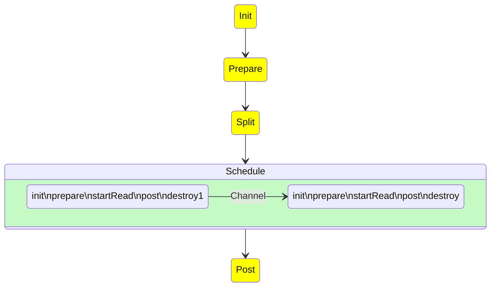
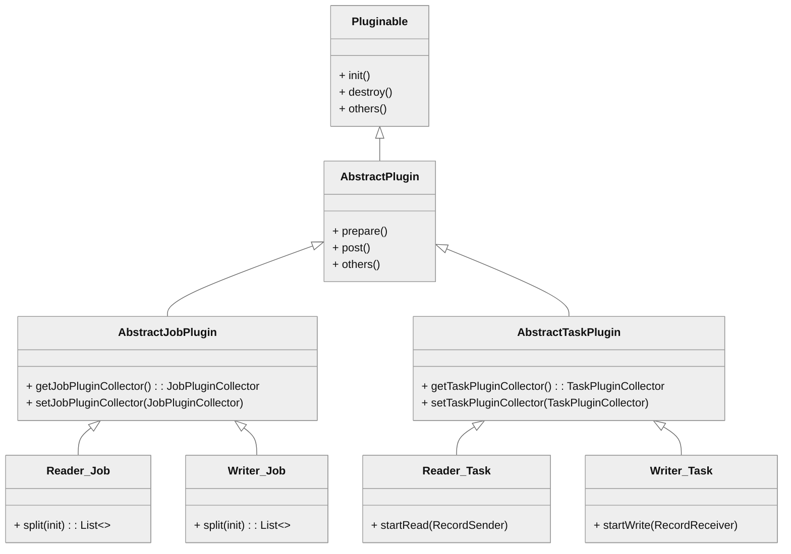
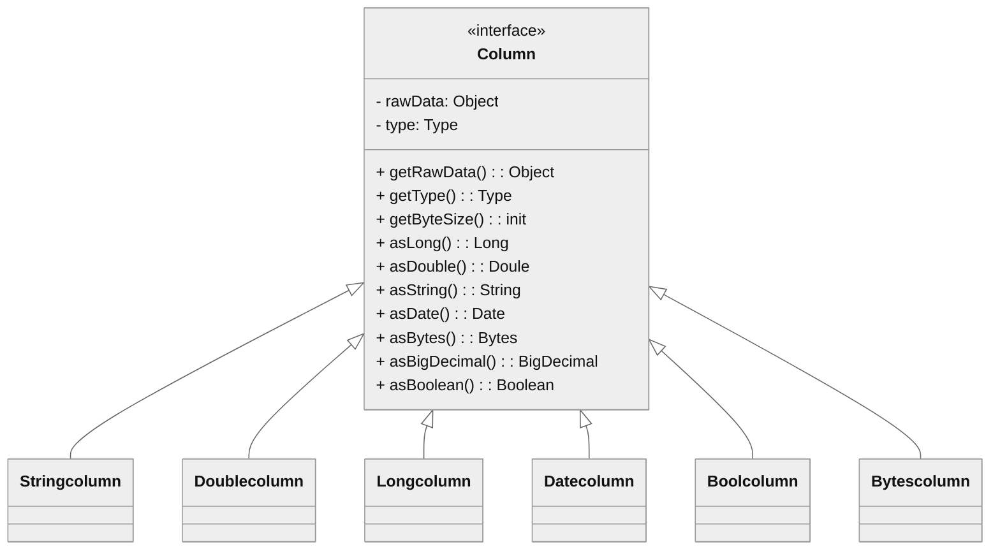

# 插件开发

本指南主要面向那些需要开发符合自己需求的 Addax 插件开发人员。

## Addax 流程

Addax 运行一个任务的大致流程如下：


启动步骤为：

1. 解析配置，包括 `job.json`、`core.json`、`plugin.json` 三个配置
2. 设置 `jobId` 到 `configuration` 当中
3. 启动 Engine，通过 `Engine.start()` 进入启动程序
4. 设置 `RUNTIME_MODE` 到 `configuration` 当中
5. 通过 JobContainer 的 `start()` 方法启动
6. 依次执行 job 的 `preHandler()`、`init()`、`prepare()`、`split()`、`schedule()`、`post()`、`postHandle()` 等方法。
7. `init()` 方法涉及到根据 configuration 来初始化 reader 和 writer 插件，这里涉及到 jar 包热加载以及调用插件 `init()` 操作方法，同时设置 reader 和 writer 的 configuration 信息
8. `prepare()` 方法涉及到初始化 reader 和 writer 插件的初始化，通过调用插件的 `prepare()` 方法实现，每个插件都有自己的 jarLoader，通过集成 `URLClassloader` 实现而来
9. `split()` 方法通过 `adjustChannelNumber()` 方法调整 channel 个数，同时执行 reader 和 writer 最细粒度的切分，需要注意的是，writer 的切分结果要参照 reader
   的切分结果，达到切分后数目相等，才能满足 1：1 的通道模型
10. channel 的计数主要是根据 byte 和 record 的限速来实现的，在 `split()` 的函数中第一步就是计算 channel 的大小
11. `split()` 方法 reader 插件会根据 channel 的值进行拆分，但是有些 reader 插件可能不会参考 channel 的值，writer 插件会完全根据 reader 的插件 1:1 进行返回
12. `split()` 方法内部的 `mergeReaderAndWriterTaskConfigs()` 负责合并 reader、writer、以及 transformer 三者关系，生成 task 的配置，并且重写 `job.content` 的配置
13. `schedule()` 方法根据 `split()` 拆分生成的 task 配置分配生成 taskGroup 对象，根据 task 的数量和单个 taskGroup 支持的 task 数量进行配置，两者相除就可以得出 taskGroup 的数量
14. `schedule()` 内部通过 AbstractScheduler 的 `schedule()` 执行，继续执行` startAllTaskGroup()` 方法创建所有的 TaskGroupContainer 组织相关的
    task，TaskGroupContainerRunner 负责运行 TaskGroupContainer 执行分配的 task。scheduler 的具体实现类为 `ProcessInnerScheduler`。
15. `taskGroupContainerExecutorService` 启动固定的线程池用以执行 `TaskGroupContainerRunner` 对象，TaskGroupContainerRunner 的 `run()` 方法调用 `taskGroupContainer.
start()` 方法，针对每个 channel 创建一个 TaskExecutor，通过 `taskExecutor.doStart()` 启动任务。

## 插件机制

`Addax` 为了应对不同数据源的差异、同时提供一致地同步原语和扩展能力，采用了 `框架` + `插件` 的模式：

- 插件只需关心数据的读取或者写入本身。
- 而同步的共性问题，比如：类型转换、性能、统计，则交由框架来处理。

作为插件开发人员，则需要关注两个问题：

1. 数据源本身的读写数据正确性。
2. 如何与框架沟通、合理正确地使用框架。

## 插件视角看框架

### 逻辑执行模型

插件开发者不用关心太多，基本只需要关注特定系统读和写，以及自己的代码在逻辑上是怎样被执行的，哪一个方法是在什么时候被调用的。在此之前，需要明确以下概念：

- `Job`: 用以描述从一个源头到一个目的端的同步作业，是数据同步的最小业务单元。比如：从一张 MySQL 的表同步到 PostgreSQL 的一个表。
- `Task`: 为最性能大化而把 `Job` 拆分得到的最小执行单元。比如：读一张有 1024 个分表的 MySQL 分库分表的 `Job`，拆分成 1024 个读 `Task`，用若干个并发执行。
- `TaskGroup`: 一组 `Task` 集合。在同一个 `TaskGroupContainer` 执行下的 `Task` 集合称之为 `TaskGroup`
- `JobContainer`: `Job` 执行器，负责 `Job` 全局拆分、调度、前置语句和后置语句等工作的工作单元。类似 [Yarn][1] 中的 JobTracker
- `TaskGroupContainer`: `TaskGroup` 执行器，负责执行一组 `Task` 的工作单元，类似 [Yarn][1] 中的 TaskTracker。

简而言之， `Job`拆分成`Task`，分别在框架提供的容器中执行，插件只需要实现 `Job` 和 `Task` 两部分逻辑。

## 编程接口

那么，`Job` 和 `Task` 的逻辑应是怎么对应到具体的代码中的？

首先，插件的入口类必须扩展 `Reader` 或 `Writer` 抽象类，并且实现分别实现 `Job` 和 `Task` 两个内部抽象类，`Job` 和 `Task` 的实现必须是 **内部类** 的形式，原因见 **加载原理** 一节。以 `Reader` 为例：

```java
public class SomeReader
        extends Reader
{
    public static class Job
            extends Reader.Job
    {
        @Override
        public void init()
        {
        }

        @Override
        public void prepare()
        {
        }

        @Override
        public List<Configuration> split(int adviceNumber)
        {
            return null;
        }

        @Override
        public void post()
        {
        }

        @Override
        public void destroy()
        {
        }
    }

    public static class Task
            extends Reader.Task
    {

        @Override
        public void init()
        {
        }

        @Override
        public void prepare()
        {
        }

        @Override
        public void startRead(RecordSender recordSender)
        {
        }

        @Override
        public void post()
        {
        }

        @Override
        public void destroy()
        {
        }
    }
}
```

`Job` 接口功能如下：

- `init`: Job 对象初始化工作，此时可以通过 `super.getPluginJobConf()` 获取与本插件相关的配置。读插件获得配置中 `reader` 部分，写插件获得 `writer` 部分。
- `prepare`: 全局准备工作，比如 MySQL 清空目标表。
- `split`: 拆分 `Task`。参数 `adviceNumber` 框架建议的拆分数，一般是运行时所配置的并发度。值返回的是 `Task` 的配置列表。
- `post`: 全局的后置工作，比如 MySQL writer 同步完影子表后的 `rename` 操作。
- `destroy`: Job 对象自身的销毁工作。

`Task` 接口功能如下：

- `init`：Task 对象的初始化。此时可以通过 `super.getPluginJobConf()` 获取与本 `Task` 相关的配置。这里的配置是 `Job#split` 方法返回的配置列表中的其中一个。
- `prepare`：局部的准备工作。
- `startRead`: 从数据源读数据，写入到 `RecordSender` 中。`RecordSender` 会把数据写入连接 `Reader` 和 `Writer` 的缓存队列。
- `startWrite`：从 `RecordReceiver` 中读取数据，写入目标数据源。`RecordReceiver` 中的数据来自 `Reader` 和 `Writer` 之间的缓存队列。
- `post`: 局部的后置工作。
- `destroy`: Task 对象自身的销毁工作。

需要注意的是：

- `Job` 和 `Task` 之间一定不能有共享变量，因为分布式运行时不能保证共享变量会被正确初始化。两者之间只能通过配置文件进行依赖。
- `prepare` 和 `post` 在 `Job` 和 `Task` 中都存在，插件需要根据实际情况确定在什么地方执行操作。

框架按照如下的顺序执行 `Job` 和 `Task` 的接口：



上图中，黄色表示 `Job` 部分的执行阶段，灰色表示 `Task` 部分的执行阶段，绿色表示框架执行阶段。

相关类关系如下：



### 插件定义

在每个插件的项目中，都有一个`plugin.json`文件，这个文件定义了插件的相关信息，包括入口类。例如：

```json
{
  "name": "mysqlwriter",
  "class": "com.wgzhao.addax.plugin.writer.mysqlwriter.MysqlWriter",
  "description": "Use Jdbc connect to database, execute insert sql.",
  "developer": "wgzhao"
}
```

- `name`: 插件名称，大小写敏感。框架根据用户在配置文件中指定的名称来搜寻插件。 **十分重要** 。
- `class`: 入口类的全限定名称，框架通过反射创建入口类的实例。**十分重要** 。
- `description`: 描述信息。
- `developer`: 开发人员。

### 打包发布

`Addax` 使用 `assembly` 打包，打包命令如下：

```bash
mvn clean package
mvn package assembly:single
```

`Addax` 插件需要遵循统一的目录结构：

```ini
${ADDAX_HOME}
├── bin
│     ├── addax.sh
├── conf
│     ├── core.json
│     └── logback.xml
├── job
├── lib
│     ├── addax-common-4.0.5.jar
│     ├── addax-core-4.0.7-SNAPSHOT.jar
│     ├── addax-rdbms-4.0.5.jar
│     ├── addax-storage-4.0.5.jar
│     ├── addax-transformer-4.0.5.jar
│     ├── aircompressor-0.21.jar
│     ├── annotations-2.0.3.jar
│     ├── checker-qual-2.11.1.jar
│     ├── commons-beanutils-1.9.4.jar
├── log
├── plugin
│     ├── reader
│     │     ├── cassandrareader
│     │     │     ├── cassandrareader-4.0.5.jar
│     │     │     ├── libs
│     │     │     │     ├── <symbol link to shared folder>
│     │     │     ├── plugin.json
│     │     │     └── plugin_job_template.json
│     └── writer
│         ├── cassandrawriter
│         │     ├── cassandrawriter-4.0.5.jar
│         │     ├── libs
│         │     │     ├── <symbol link to shared folder>
│         │     ├── plugin.json
│         │     └── plugin_job_template.json
```

- `${ADDAX_HOME}/bin`: 可执行程序目录
- `${ADDAX_HOME}/conf`: 框架配置目录
- `${ADDAX_HOME}/lib`: 框架依赖库目录
- `${ADDAX_HOME}/shared`: 插件依赖目录
- `${ADDAX_HOME}/plugin`: 插件目录

插件目录分为 `reader` 和 `writer` 子目录，读写插件分别存放。插件目录规范如下：

- `${PLUGIN_HOME}/libs`: 插件的依赖库，为了减少程序包大小，这些依赖包都是指向 `shared` 目录的符号链接
- `${PLUGIN_HOME}/plugin-name-version.jar`: 插件本身的 jar。
- `${PLUGIN_HOME}/plugin.json`: 插件描述文件。

尽管框架加载插件时，会把 `${PLUGIN_HOME}` 下所有的 jar 包添加到 `classpath` 环境变量中，但还是推荐依赖库的 jar 和插件本身的 jar 分开存放。

!!! 特别提醒

    插件的目录名字必须和 `plugin.json` 中定义的插件名称一致。

## 配置文件

`Addax` 使用 `json` 作为配置文件的格式。一个典型的 `Addax` 任务配置如下：

```json
--8<-- "jobs/pgwriter.json"
```

`Addax` 框架有 `core.json` 配置文件，指定了框架的默认行为。任务的配置里头可以指定框架中已经存在的配置项，而且具有更高的优先级，会覆盖 `core.json` 中的默认值。

配置中`job.content.reader.parameter` 的 `value` 部分会传给 `Reader.Job`；`job.content.writer.parameter` 的 `value` 部分会传给`Writer.Job` ，
`Reader.Job` 和 `Writer.Job` 可以通过 `super.getPluginJobConf()` 来获取。

### 如何设计配置参数

> 配置文件的设计是插件开发的第一步！

任务配置中 `reader` 和 `writer` 下 `parameter` 部分是插件的配置参数，插件的配置参数应当遵循以下原则：

- 驼峰命名：所有配置项采用小驼峰命名法，首字母小写。
- 正交原则：配置项必须正交，功能没有重复，没有潜规则。
- 富类型：合理使用 json 的类型，减少无谓的处理逻辑，减少出错的可能。
  - 使用正确的数据类型。比如，`bool` 类型的值使用 `true`/`false`，而非 `"yes"`/`"true"`/`0` 等。
  - 合理使用集合类型，比如，用数组替代有分隔符的字符串。
- 类似通用：遵守同一类型的插件的习惯，比如关系型数据库的 `connection` 参数都是如下结构：

  ```json
  {
    "connection": [
      {
        "table": ["table_1", "table_2"],
        "jdbcUrl": [
          "jdbc:mysql://127.0.0.1:3306/database_1",
          "jdbc:mysql://127.0.0.2:3306/database_1_slave"
        ]
      },
      {
        "table": ["table_3", "table_4"],
        "jdbcUrl": [
          "jdbc:mysql://127.0.0.3:3306/database_2",
          "jdbc:mysql://127.0.0.4:3306/database_2_slave"
        ]
      }
    ]
  }
  ```

### 如何使用 `Configuration` 类

为了简化对 `json` 的操作，`Addax` 提供了简单的 DSL 配合 `Configuration` 类使用。

`Configuration` 提供了常见的 `get`, `带类型get`，`带默认值get`，`set` 等读写配置项的操作，以及 `clone`, `toJSON` 等方法。配置项读写操作都需要传入一个 `path` 做为参数， 这个 `path` 就是 `Addax` 定义的 DSL。语法有两条：

1. 子 map 用 `.key` 表示，`path` 的第一个点省略。
2. 数组元素用 `[index]` 表示。

比如操作如下 json：

```json
{
  "a": {
    "b": {
      "c": 2
    },
    "f": [
      1,
      2,
      {
        "g": true,
        "h": false
      },
      4
    ]
  },
  "x": 4
}
```

比如调用 `configuration.get(path)` 方法，当 path 为如下值的时候得到的结果为：

- `x`：`4`
- `a.b.c`：`2`
- `a.b.c.d`：`null`
- `a.b.f[0]`：`1`
- `a.b.f[2].g`：`true`

注意，因为插件看到的配置只是整个配置的一部分。使用 `Configuration` 对象时，需要注意当前的根路径是什么。

更多 `Configuration` 的操作请参考 [Configuration.java][2] 。

## 插件数据传输

跟一般的 `生产者-消费者` 模式一样，`Reader` 插件和 `Writer` 插件之间也是通过 `channel` 来实现数据的传输的。`channel` 可以是内存的，也可能是持久化的，插件不必关心。 插件通过 `RecordSender` 往 `channel` 写入数据，通过 `RecordReceiver` 从 `channel` 读取数据。

`channel` 中的一条数据为一个 `Record` 的对象，`Record` 中可以放多个 `Column` 对象，这可以简单理解为数据库中的记录和列。

`Record` 有如下方法：

```java
public interface Record
{
    // 加入一个列，放在最后的位置
    void addColumn(Column column);

    // 在指定下标处放置一个列
    void setColumn(int i, final Column column);

    // 获取一个列
    Column getColumn(int i);

    // 转换为json String
    String toString();

    // 获取总列数
    int getColumnNumber();

    // 计算整条记录在内存中占用的字节数
    int getByteSize();
}
```

因为 `Record` 是一个接口，`Reader` 插件首先调用 `RecordSender.createRecord()` 创建一个 `Record` 实例，然后把 `Column` 一个个添加到 `Record` 中。

`Writer` 插件调用 `RecordReceiver.getFromReader()` 方法获取 `Record`，然后把 `Column` 遍历出来，写入目标存储中。当 `Reader` 尚未退出，传输还在进行时，如果暂时没有数据 `RecordReceiver.getFromReader()` 方法会阻塞直到有数据。
如果传输已经结束，会返回`null`，`Writer` 插件可以据此判断是否结束 `startWrite` 方法。

## 类型转换

为了规范源端和目的端类型转换操作，保证数据不失真，Addax 支持六种内部数据类型：

- `Long`：定点数(Int、Short、Long、BigInteger 等)。
- `Double`：浮点数(Float、Double、BigDecimal(无限精度)等)。
- `String`：字符串类型，底层不限长，使用通用字符集(Unicode)。
- `Date`：日期类型。
- `Timestamp`: 时间戳
- `Bool`：布尔值。
- `Bytes`：二进制，可以存放诸如 MP3 等非结构化数据。

对应地，有 `DateColumn`、`LongColumn`、`DoubleColumn`、`BytesColumn`、`StringColumn` 、`BoolColumn` 和 `TimestampColumn` 七种 `Column` 的实现。

`Column` 除了提供数据相关的方法外，还提供一系列以 `as` 开头的数据类型转换转换方法。



Addax 的内部类型在实现上会选用不同的 java 类型：

| 内部类型  | 实现类型             | 备注                             |
| --------- | -------------------- | -------------------------------- |
| Date      | java.util.Date       |                                  |
| Timestamp | java.sql.Timestamp   | 可以精确到纳秒                   |
| Long      | java.math.BigInteger | 使用无限精度的大整数，保证不失真 |
| Double    | java.lang.String     | 用 String 表示，保证不失真       |
| Bytes     | byte[]               |                                  |
| String    | java.lang.String     |                                  |
| Bool      | java.lang.Boolean    |                                  |

类型之间相互转换的关系如下：

| from/to | Date                    | Long                     | Double                       | Bytes                        | String                     | Bool                                                |
| ------- | ----------------------- | ------------------------ | ---------------------------- | ---------------------------- | -------------------------- | ---------------------------------------------------- |
| Date    | -                       | 使用毫秒时间戳           | 不支持                       | 不支持                       | 按配置格式转换             | 不支持                                                     |
| Long    | 作为毫秒时间戳构造 Date | -                        | `BigDecimal.doubleValue()`   | 不支持                       | `BigInteger.toString()`    | 0 为 `false`，其他为 `true`                             |
| Double  | 不支持                  | `BigDecimal.longValue()` | -                            | 不支持                       | 直接返回内部 String        | 不支持                                                     |
| Bytes   | 不支持                  | 不支持                   | 不支持                       | -                            | 按utf-8编码转换为 `byte[]` | 不支持                                                     |
| String  | 按配置的 格式解析       | `BigDecimal.longValue`   | `BigDecimal.doubleValue`[^1] | 按 utf-8 编码[^2]转换为 `byte[]` | -                          | "true"为`true`, "false"为`false`，不区分大小写。其他不支持 |
| Bool    | 不支持                  | `true`为`1L`，否则`0L`   | 不支持                       | `true`为`1.0`，否则`0.0`     | 不支持                     | -                                                          |


## 脏数据处理

### 什么是脏数据

目前主要有三类脏数据：

1. Reader 读到不支持的类型、不合法的值。
2. 不支持的类型转换，比如：`Bytes` 转换为 `Date`。
3. 写入目标端失败，比如：写 MySQL 整型长度超长。

### 如何处理脏数据

在 `Reader.Task` 和 `Writer.Task` 中，通过 `AbstractTaskPlugin.getPluginCollector()` 可以拿到一个 `TaskPluginCollector`，它提供了一系列 `collectDirtyRecord` 的方法。 当脏数据出现时，只需要调用合适的 `collectDirtyRecord`
方法，把被认为是脏数据的 `Record` 传入即可。

用户可以在任务的配置中指定脏数据限制条数或者百分比限制，当脏数据超出限制时，框架会结束同步任务，退出。插件需要保证脏数据都被收集到，其他工作交给框架就好。

## 加载原理

1. 框架扫描 `plugin/reader` 和 `plugin/writer `目录，加载每个插件的 `plugin.json` 文件。
2. 以 `plugin.json` 文件中 `name` 为 key，索引所有的插件配置。如果发现重名的插件，框架会异常退出。
3. 用户在插件中在 `reader`/`writer` 配置的 `name` 字段指定插件名字。框架根据插件的类型（`reader`/`writer`）和插件名称去插件的路径下扫描所有的 jar，加入 `classpath`。
4. 根据插件配置中定义的入口类，框架通过反射实例化对应的 `Job` 和 `Task` 对象。

[1]: https://hadoop.apache.org/docs/stable/hadoop-yarn/hadoop-yarn-site/YARN.html
[2]: https://github.com/wgzhao/Addax/blob/master/common/src/main/java/com/wgzhao/addax/common/util/Configuration.java

[^1]: 处理 `NaN`, `Infinity`, `-Infinity` 等数值
[^2]: 除非另有指定编码格式