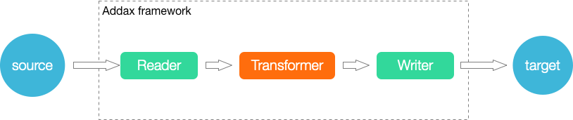

# Transformer 插件文档

## Transformer定义

在数据同步、传输过程中，存在用户对于数据传输进行特殊定制化的需求场景，包括裁剪列、转换列等工作，可以借助ETL的T过程实现(Transformer)。DataX包含了完成的E(Extract)、T(Transformer)、L(Load)支持。

## 运行模型



## UDF 函数

### dx_substr

`dx_substr(idx, pos, length) -> str`

参数

- `idx`: 字段编号，对应record中第几个字段
- `pos`: 字段值的开始位置
- `length`: 目标字段长度

返回： 从字符串的指定位置（包含）截取指定长度的字符串。如果开始位置非法抛出异常。如果字段为空值，直接返回（即不参与本transformer）

### dx_pad

`dx_pad(idx, flag, length, chr)`

参数

- `idx`: 字段编号，对应record中第几个字段
- `flag`: "l","r", 指示是在头进行填充，还是尾进行填充
- `length`: 目标字段长度
- `chr`: 需要填充的字符

返回： 如果源字符串长度小于目标字段长度，按照位置添加pad字符后返回。如果长于，直接截断（都截右边）。如果字段为空值，转换为空字符串进行pad，即最后的字符串全是需要pad的字符

举例：

```
dx_pad(1,"l","4","A"), 如果column 1 的值为 xyz=> Axyz， 值为 xyzzzzz => xyzz
dx_pad(1,"r","4","A"), 如果column 1 的值为 xyz=> xyzA， 值为 xyzzzzz => xyzz
```

### dx_replace

`dx_replace(idx, pos, length, str) -> str`

参数

- `idx`: 字段编号，对应record中第几个字段
- `pos`: 字段值的开始位置
- `length`: 需要替换的字段长度
- `str`: 要替换的字符串

返回： 从字符串的指定位置（包含）替换指定长度的字符串。如果开始位置非法抛出异常。如果字段为空值，直接返回（即不参与本transformer）

举例：

```
dx_replace(1,"2","4","****")  column 1的value为“dataxTest”=>"da****est"
dx_replace(1,"5","10","****")  column 1的value为“dataxTest”=>"data****"
```

### dx_filter

`dx_filter(idx, operator, expr) -> str`

参数：

- `idx`: 字段编号，对应record中第几个字段
- `operator`: 运算符, 支持 `like`, `not like`, `>`, `=`, `<`, `>=`, `!=`, `<=`
- `expr`: 正则表达式（java正则表达式）、值
- `str`: 要替换的字符串

返回：

- 如果匹配正则表达式，返回Null，表示过滤该行。不匹配表达式时，表示保留该行。（注意是该行）。对于 `>`, `=`, `<`都是对字段直接compare的结果.
- `like` ， `not like` 是将字段转换成字符类型，然后和目标正则表达式进行全匹配。
- `>`, `=`, `<`, `>=`, `!=`, `<=` ,按照类型进行比较, 数值类型按大小比较,字符及布尔类型按照字典序比较
- 如果目标字段为空（null），对于 `= null` 的过滤条件，将满足条件，被过滤。`！=null` 的过滤条件，null不满足过滤条件，不被过滤。 `like`，字段为null不满足条件，不被过滤，和 `not like`，字段为null满足条件，被过滤。

举例

```
dx_filter(1,"like","dataTest")  
dx_filter(1,">=","10")  
```

关联filter暂不支持，即多个字段的联合判断，函参太过复杂，用户难以使用。

### dx_groovy

`dx_groovy(code, package) -> record`

参数

- `coee`: 符合 groovy 编码要求的代码
- `package`: extraPackage, 列表或者为空

返回

Record 数据类型

注意：

- `dx_groovy` 只能调用一次。不能多次调用。
- `groovy code` 中支持 `java.lang`, `java.util` 的包，可直接引用的对象有 `record`，以及element下的各种column（BoolColumn.class,BytesColumn.class,DateColumn.class,DoubleColumn.class,LongColumn.clas-
  tringColumn.class）。不支持其他包，如果用户有需要用到其他包，可设置extraPackage，注意extraPackage不支持第三方jar包。
- `groovy code` 中，返回更新过的 `Record`（比如record.setColumn(columnIndex, new StringColumn(newValue));），或者null。返回null表示过滤此行。
- 用户可以直接调用静态的Util方式（GroovyTransformerStaticUtil

举例:

groovy 实现的 subStr

```java
String code="Column column = record.getColumn(1);\n"+
        " String oriValue = column.asString();\n"+
        " String newValue = oriValue.substring(0, 3);\n"+
        " record.setColumn(1, new StringColumn(newValue));\n"+
        " return record;";
        dx_groovy(record);
```

groovy 实现的Replace

```java
String code2="Column column = record.getColumn(1);\n"+
        " String oriValue = column.asString();\n"+
        " String newValue = \"****\" + oriValue.substring(3, oriValue.length());\n"+
        " record.setColumn(1, new StringColumn(newValue));\n"+
        " return record;";
```

groovy 实现的Pad

```java
String code3="Column column = record.getColumn(1);\n"+
        " String oriValue = column.asString();\n"+
        " String padString = \"12345\";\n"+
        " String finalPad = \"\";\n"+
        " int NeedLength = 8 - oriValue.length();\n"+
        "        while (NeedLength > 0) {\n"+
        "\n"+
        "            if (NeedLength >= padString.length()) {\n"+
        "                finalPad += padString;\n"+
        "                NeedLength -= padString.length();\n"+
        "            } else {\n"+
        "                finalPad += padString.substring(0, NeedLength);\n"+
        "                NeedLength = 0;\n"+
        "            }\n"+
        "        }\n"+
        " String newValue= finalPad + oriValue;\n"+
        " record.setColumn(1, new StringColumn(newValue));\n"+
        " return record;";
```

## Job定义

本例中，配置3个UDF。

```json
{
  "job": {
    "setting": {
      "speed": {
        "channel": 1
      }
    },
    "content": [
      {
        "reader": {
          "name": "streamreader",
          "parameter": {
            "column": [
              {
                "value": "DataX",
                "type": "string"
              },
              {
                "value": 19890604,
                "type": "long"
              },
              {
                "value": "1989-06-04 00:00:00",
                "type": "date"
              },
              {
                "value": true,
                "type": "bool"
              },
              {
                "value": "test",
                "type": "bytes"
              }
            ],
            "sliceRecordCount": 100000
          }
        },
        "writer": {
          "name": "streamwriter",
          "parameter": {
            "print": false,
            "encoding": "UTF-8"
          }
        },
        "transformer": [
          {
            "name": "dx_substr",
            "parameter": {
              "columnIndex": 5,
              "paras": [
                "1",
                "3"
              ]
            }
          },
          {
            "name": "dx_replace",
            "parameter": {
              "columnIndex": 4,
              "paras": [
                "3",
                "4",
                "****"
              ]
            }
          },
          {
            "name": "dx_groovy",
            "parameter": {
              "code": "//groovy code//",
              "extraPackage": [
                "import somePackage1;",
                "import somePackage2;"
              ]
            }
          }
        ]
      }
    ]
  }
}
```

## 计量和脏数据

Transform过程涉及到数据的转换，可能造成数据的增加或减少，因此更加需要精确度量，包括：

- Transform的入参Record条数、字节数。
- Transform的出参Record条数、字节数。
- Transform的脏数据Record条数、字节数。
- 如果是多个Transform，某一个发生脏数据，将不会再进行后面的transform，直接统计为脏数据。
- 目前只提供了所有Transform的计量（成功，失败，过滤的count，以及transform的消耗时间）。

涉及到运行过程的计量数据展现定义如下：

```shell
Total 1000000 records, 22000000 bytes | Transform 100000 records(in), 10000 records(out) | Speed 2.10MB/s, 100000 records/s | Error 0 records, 0 bytes | Percentage 100.00%
```

注意，这里主要记录转换的输入输出，需要检测数据输入输出的记录数量变化。

涉及到最终作业的计量数据展现定义如下：

```shell
任务启动时刻                    : 2015-03-10 17:34:21
任务结束时刻                    : 2015-03-10 17:34:31
任务总计耗时                    :                 10s
任务平均流量                    :            2.10MB/s
记录写入速度                    :         100000rec/s
转换输入总数                    :             1000000
转换输出总数                    :             1000000
读出记录总数                    :             1000000
同步失败总数                    :                   0
```

注意，这里主要记录转换的输入输出，需要检测数据输入输出的记录数量变化。
