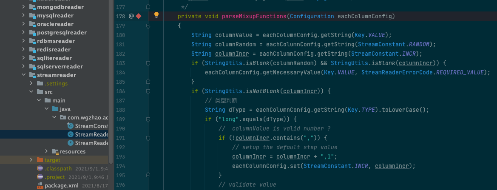
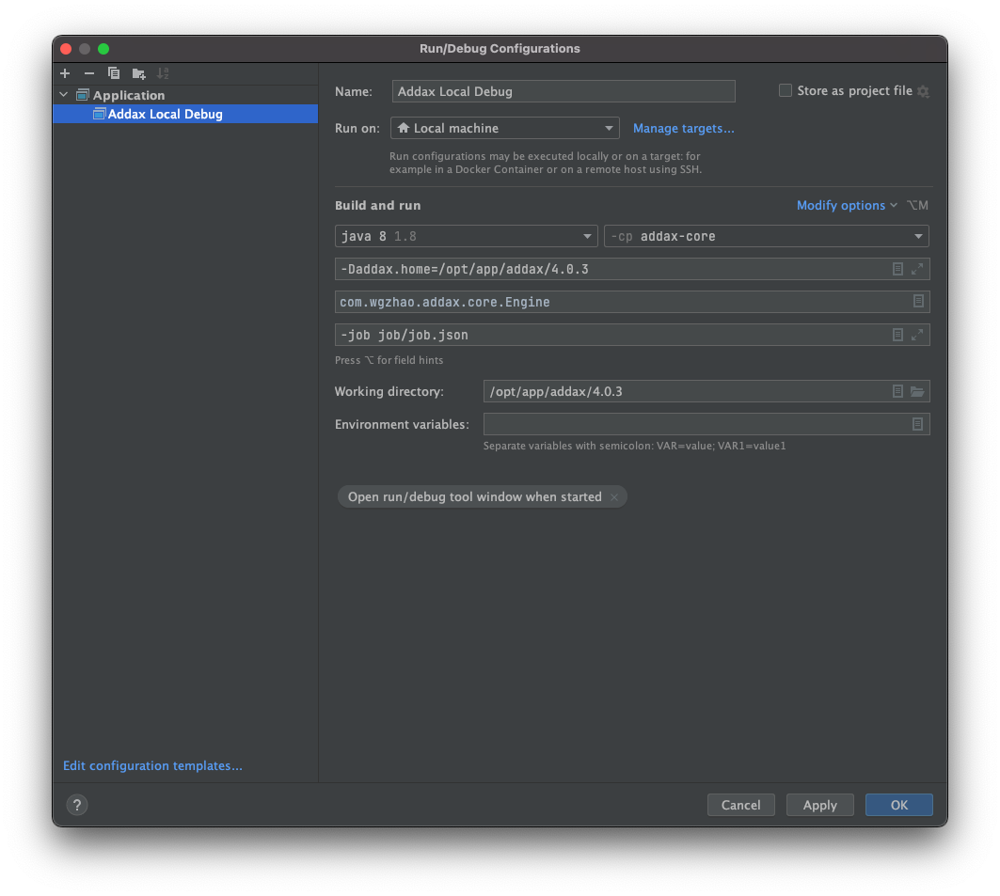
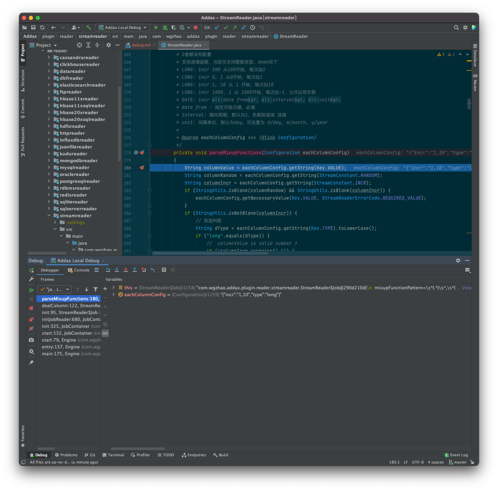
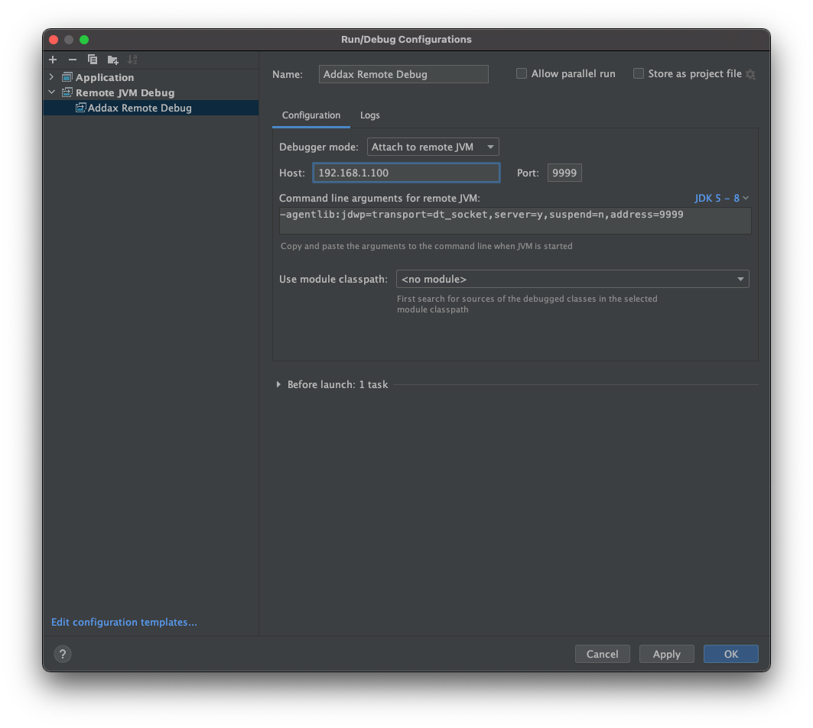
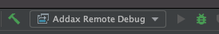

# 如何调试项目

如果你想在本地修改或者调试代码，可以参考以下方式，以下的操作均以 [Intellij IDEA](https://www.jetbrains.com/idea/) 开发工具为例。

调试可以分成两方方式，一种是代码和二进制包都在本地，我们称之为本地调试；另外一种源代码在本地，但二进制程序已经部署在远程，这种情况下我们称之为远程调试。

下面分别描述

## 本地调试

### 一些设定

我们假定本地部署的 `Addax` 在 `/opt/app/addax/4.0.3` 文件夹下。其 `job` 目录下有这样的一个 `job.json` 配置文件，内容如下：

=== "job/job.json"

  ```json
  --8<-- "jobs/quickstart.json"
  ```

上述 job 文件运行没有符合我们的预期，猜测是 `streamreader` 这个插件的 `parseMixupFunctions` 函数有问题，我想调试看具体问题在哪里。

### 配置 IDEA

打开 IDEA工具，并打开 `addax` 项目源代码，打开 `plugin/reader/streamreader/StreamReader.java` 文件，找到 `parseMixupFunctions` 函数，并在函数申明处的点击左侧边缘处增加断点。如下图所示：



点击 `IDEA` 的 `Run->Edit Configurations...` 菜单，在弹出的 `Run/Debug Configurations` 窗口，点击左上角的 `+` 按钮，然后选择 选择 `Application` ，在右侧配置框中，填写相关信息如下：

- Name: 调试描述名称，这里可以按照自己喜好填写
- Run on: 选择 `Local machine`
- Build and run:
  - 第一个框: 选择 JDK 版本，当前支持 17 版本，建议选择 17 版本
  - 第二个框: 选择 `addax-core` 模块
  - `Main class`: 填写 `com.wgzhao.addax.core.Engine`
  - 点击 `Modify options`，在弹出的下拉框中，选择 `Add VM Options`，在增加的 `VM Options` 中，填写 `-Daddax.home=/opt/app/addax/4.0.3`。如果你的reader或者writer依赖了lib中的代码，则还需要添加 `-classpath .:/opt/app/addax/4.0.3/lib/*`，如果没有依赖，则不需要添加。
  - `Program arguments`: 填写 `-job job/job.json`
- `Working directory`： 填写 `/opt/app/addax/4.0.3`

其他保持不变，点击 `Apply` 按钮。得到类似下图配置内容



点击 `OK` 按钮保存上述配置，回到 `IDEA` 主窗口，在窗口菜单栏有绿色`🔨`的右侧，应该可以看到刚才配置的描述文件，类似下图：


点击上述截图中的绿色 DEBUG 小虫按钮，进入调试，得到类似下图的调试窗口：



## 远程调试

### 一些假定

假定程序部署在远程服务器上，需要直接调试远程服务器上运行的程序，假定远程服务器IP地址为 `192.168.1.100`，`Addax` 部署在 `/opt/addax/4.0.3` 目录下，其 `job` 文件夹下，也有一个和本地调试中描述的 `job.json` 文件。
同样的，上述 job 文件运行没有符合我们的预期，猜测是 `streamreader` 这个插件的 `parseMixupFunctions` 函数有问题，我想调试看具体问题在哪里。

注意：远程调试需要在服务器打开 `9999` 端口，因此要保证服务器上的 `9999` 端口没有被占用，如果被占用，则需要修改此端口。

修改方式如下：

1. 打开 `bin/addax.sh` 脚本
2. 定位到大约24行处，找到 `address=0.0.0.0:9999` 字符串
3. 将 `9999` 修改成其他未被占用的端口
4. 保存退出

### 配置 IDEA

打开 IDEA工具，并打开 `addax` 项目源代码，打开 `plugin/reader/streamreader/StreamReader.java` 文件，找到 `parseMixupFunctions` 函数，并在函数申明处的点击左侧边缘处增加断点。如下图所示：


点击 `IDEA` 的 `Run->Edit Configurations...` 菜单，在弹出的 `Run/Debug Configurations` 窗口，点击左上角的 `+` 按钮，然后选择 选择 `Remove JVM Debug` ，在右侧配置框中，填写相关信息如下：

- Name: 调试描述名称，这里可以按照自己喜好填写
- Configuration:
  - Host: 填写远程服务器IP地址，这里填写 `192.168.1.100`
  - Port: 填写调试端口，这里填写 `9999` 或者你修改过的端口
  
其他保持不变，点击 `Apply` 按钮，得到如下配置信息：



点击 `OK` 按钮保存并返回到 `IDEA` 主窗口

确保在窗口工具栏有绿色`🔨`的右侧选择的是上述填写 `Name` 的描述配置，否则在下拉框中选择刚才的配置。



### 运行调试

运行远程调试分成两个步骤，一是启动程序，二是调试工具联接到运行的程序上。

在远程服务器上运行如下命令：

`bin/addax.sh -d job/job.json`

如果运行正常，会得到如下信息：

```shell
bin/addax.sh -d job/job.json
Listening for transport dt_socket at address: 9999
```

表示程序监听在 `9999` 端口上，等待联接。

返回 `IDEA` 窗口，点击工具栏上绿色 DEBUG 小虫按钮，开始调试，如果运行正常，会得到类似下图的调试窗口：


